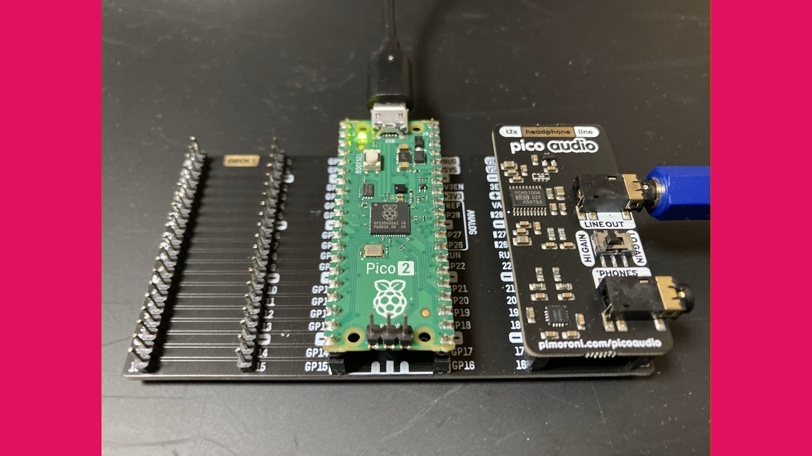

MIDI Synth SPMS-1
=================

- MIDI Synthesizer built with Spinel (Ruby AOT Compiler)
- Developed by ISGK Instruments (Ryo Ishigaki)
- <https://github.com/risgk/midi-synth-spms-1>

SPMS-1 (type-0)
---------------

- Required Hardware: Raspberry Pi Pico 2, Pimoroni Pico Audio Pack (or alternative I2S DAC hardware)
- [README](./spms_1_type_0/README.md)

