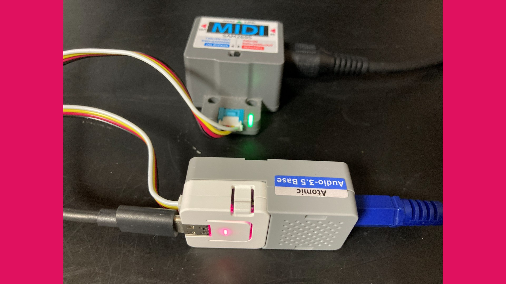

MIDI Synthesizer SPMS-1
=======================

- MIDI Synthesizer made with Spinel (Ruby AOT Compiler)
- Developed by ISGK Instruments (Ryo Ishigaki)
- <https://github.com/risgk/midi_synthesizer_spms1>
- [日本語版 README](./README.ja.md)

SPMS-1 (type-1)
---------------

- Monophonic semi-modular MIDI Synthesizer for M5Stack AtomS3 Lite and Raspberry Pi Pico 2
- Filter: ZDF/TPT State Variable Filter (with delayed soft clipping)
- Required Hardware: M5Stack AtomS3 Lite and Atomic Audio-3.5 Base (recommended), or Raspberry Pi Pico 2 and Pimoroni Pico Audio Pack (or alternative I2S DAC hardware)
- [README](./spms1_type1/README.md) / [日本語版](./spms1_type1/README.ja.md)

SPMS-1 (type-0)
---------------

- See [Spinel x Raspberry Pi Pico 2でシンセサイザーを作ってみた #nagoyark05 - Speaker Deck](https://speakerdeck.com/risgk/spinel-x-raspberry-pi-pico-2-de-shinsesaiza-o-tsuku-te-mita-nagoyark05)
- Monophonic semi-modular MIDI Synthesizer for Raspberry Pi Pico 2
- Filter: Nonlinear biquad
- Required Hardware: Raspberry Pi Pico 2, Pimoroni Pico Audio Pack (or alternative I2S DAC hardware)
- [README](./spms1_type0/README.md) / [日本語版](./spms1_type0/README.ja.md)

