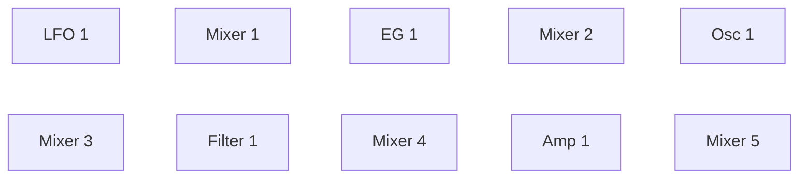

MIDI Synthesizer SPMS-1 (type-0) v0.1.0
=======================================

- Spinel (Ruby AOT コンパイラ) で作った、Raspberry Pi Pico 2 用のモノフォニック・セミモジュラー MIDI シンセサイザー
- 音源モジュールとして MIDI で制御します
- 48 kHz/24 bit オーディオ出力
- 開発: ISGK Instruments (Ryo Ishigaki)
- <https://github.com/risgk/midi_synthesizer_spms1>
- [English README](./README.md) (英語版が正です)


必要なハードウェア
------------------

- [Raspberry Pi Pico 2](https://www.raspberrypi.com/products/raspberry-pi-pico-2/)
- Pimoroni [Pico Audio Pack](https://shop.pimoroni.com/products/pico-audio-pack) (PIM544)
    - 以下の I2S DAC ハードウェア (48 kHz/24 bit) も使えます:
        - [Adafruit PCM5102 I2S DAC](https://www.adafruit.com/product/6250) (Product ID: 6250)
        - GY-PCM5102 (PCM5102A I2S DAC モジュール)


改造に必要なソフトウェア
------------------------

- [Arduino IDE](https://www.arduino.cc/en/software)
- Arduino-Pico = Raspberry Pi Pico/RP2040/RP2350 (by Earle F. Philhower, III) コア
    - 追加のボードマネージャ URL: <https://github.com/earlephilhower/arduino-pico/releases/download/global/package_rp2040_index.json>
    - このスケッチはバージョン 6.0.0 で動作確認しています: <https://github.com/earlephilhower/arduino-pico/releases/tag/6.0.0>
    - 情報: <https://github.com/earlephilhower/arduino-pico>
- Arduino MIDI Library (by Francois Best, lathoub)
    - このスケッチはバージョン 5.0.2 で動作確認しています: <https://github.com/FortySevenEffects/arduino_midi_library/releases/tag/5.0.2>
    - 情報: <https://github.com/FortySevenEffects/arduino_midi_library>
- Spinel
    - コミット: <https://github.com/matz/spinel/tree/5af61ae7d53e36ca59a8de5870f532360d88fd7c>
    - Spinel の出力ファイル "spms1_main.c" に手を入れる必要はありません。本スケッチの "sp_runtime.h" が
      `#define main __attribute__((section(".time_critical"), flatten)) Spms1_main` を持っており、改名と
      シンセ本体の RAM 配置を同時に行います。手で改名すると、このマクロが一致しなくなって属性が付かず、
      本体が flash から実行されます


使い方
------

### ビルド済みバイナリ

- "bin" フォルダの "spms1_type0.ino.uf2" は Raspberry Pi Pico 2 と Pimoroni Pico Audio Pack 用です


### Web エディタ

- Web MIDI API を使う、プラットフォームを問わないパラメータ・コントローラ: "spms1_editor.html"
- 音を出して試すためのソフトウェア鍵盤を内蔵しています


### MIDI の設定

- MIDI チャンネル: チャンネル 1
- USB MIDI 入力
    - 製造者ディスクリプタ: "ISGK Instruments"
    - デバイス名: "SPMS-1 (type-0)"
- UART MIDI 入力
    - 速度: 31250 bps
    - GP4 ピンと GP5 ピンを UART1 TX と UART1 RX に使います
    - 以下のように書き換えれば `SoftwareSerial` も使えます:

        ```cpp
        #include <SoftwareSerial.h>
        #define SPMS1_UART_MIDI_TX_PIN              (4)
        #define SPMS1_UART_MIDI_RX_PIN              (5)
        SoftwareSerial mySerial(SPMS1_UART_MIDI_RX_PIN, SPMS1_UART_MIDI_TX_PIN);
        #define SPMS1_UART_MIDI_SERIAL              mySerial
        ```

        ```cpp
        //  SPMS1_UART_MIDI_SERIAL.setTX(SPMS1_UART_MIDI_TX_PIN);
        //  SPMS1_UART_MIDI_SERIAL.setRX(SPMS1_UART_MIDI_RX_PIN);
        ```

    - DIN/TRS MIDI は、たとえば Adafruit MIDI FeatherWing Kit などを使う (そして手を入れる) ことで利用できます
        - Adafruit [MIDI FeatherWing Kit](https://www.adafruit.com/product/4740) (Product ID: 4740)
        - M5Stack [Midi Unit with DIN Connector (SAM2695)](https://shop.m5stack.com/products/midi-unit-with-din-connector-sam2695) (SKU: U187) のセパレートモード
        - Kinoshita Laboratory [MIDI-UART interface-san Kit](https://www.tindie.com/products/kinoshitalab/midi-uart-interface-san-kit/)
        - 木下研究所 [MIDI-UARTインターフェースさん キット](https://www.switch-science.com/products/8117) (日本国内発送のみ)
        - necobit電子 [MIDI Unit for GROVE](https://necobit.com/denshi/grove-midi-unit/) (日本国内発送のみ)
        - necobit電子 [MIDI Unit Mini for GROVE](https://necobit.com/denshi/midi-unit-mini-for-grove/) (日本国内発送のみ)


### [MIDI インプリメンテーション・チャート](./spms1_midi_chart.md)


### ブロック図

デフォルトのパッチです。実線の矢印がオーディオ信号を、破線の矢印がコントロール信号を運びます。


モジュールは下の実行順で、1 サンプルずつ処理されます。波形やカットオフ、ゲインといったパラメータは CC
から届くもので、この図では省いています。

Mixer 1 がビブラートの経路に入っているのは、LFO を 0.2 倍に落とすためです。Osc 1 Mod Amt はここにある
どのモジュレーション深度とも同じくピッチの全域に届くので、ソースを音楽的な深さまで絞る仕事はオシレータに
作り込まず、ミキサーに任せています。

以上はどれも固定ではありません。実行順も、上の図のすべての矢印も、どの CC がどのパラメータに入るかも、
NRPN が書き換えます。

#### 実行順

すべてのモジュールが入っています。音を作る型が 1 つずつと、そのそれぞれの後ろに 1 つずつのミキサーです。



Mixer 2 から 5 には何も結線されていないので、毎サンプル自分のスロットぶんのコストを払うだけで、パッチが
何かを与えるまでは何も変えません。どこに座っているかがそのまま価値になります。あるモジュールが今サンプル
の値を見られるのは、この列で自分より前にあるものからだけで、後ろにあるものからは前サンプルの値を受け取り
ます。Mixer 1 は LFO に、Mixer 3 はオシレータに手が届く、という具合です。

ミキサーは 2 つの信号を合流させるための道具であり、Pitch Bend を除けば、正負どちらにも振れる信号を
モジュール入力へ渡す唯一の手段でもあります。下の例を参照してください。

### パッチの編集 (NRPN)

パッチはデータであり、NRPN は動いているシンセのそれを書き換えます。どのモジュールがどの順で走るか、各
モジュール入力に何が入るか、各パラメータがどこから値を取るか、どの CC がどのコントロールスロットを埋める
か。すべてのモジュールは番号の付いたシグナルスロットから読み、番号の付いたスロットへ書くので、配線し直す
こととはスロット番号を変えることです。

#### 送り方

- CC 99 でカテゴリを、CC 98 でその中のエントリを選びます。順序はどちらが先でも構いません
- CC 6 (Data Entry MSB) で値が確定し、次のオーディオバッファから効きます
- CC 38 (Data Entry LSB) は無視されます。ここで扱う値はすべて 7 ビットです
- CC 101 と CC 100 (RPN セレクト) はデータ入力を中断させるので、RPN がパッチ編集と取り違えられることは
  ありません。再開するには CC 99 か CC 98 をもう一度送ります
- 編集内容は保存されません。電源投入時にデフォルトのパッチへ戻ります

#### カテゴリ (CC 99)

| CC 99 | CC 98 | 設定する対象 | CC 6 の値 |
| ----- | ----- | ---- | ---------- |
| 0 | 0-31 | 実行順、スロットごとに | モジュール ID |
| 1 | 0-17 | モジュール入力に何を入れるか | シグナル ID |
| 2 | 0-32 | パラメータがどこから値を取るか | シグナル ID |
| 3 | 0-32 | どの CC がコントロールスロットを埋めるか | CC 番号、0 なら割り当てなし |

実行順はスロット 0 から上へ読まれ、最初に現れたモジュール ID 0 で止まります。32 個に満たないパッチは
そこで自ら終わるわけです。実行順はモジュールの番号付けとは別物です。あるモジュールが今サンプルの値を
見られるのは自分より前に並んでいるものからだけで、後ろにあるものからは前サンプルの値を受け取ります。

カテゴリ 3 で CC 番号 0 を指定すると、そのパラメータには CC がない状態になります。コントロールスロットは
そのとき持っている値をそのまま保つので、パラメータをルーティングだけで動かせます。

音を作るモジュールは 1 つずつ、ミキサーは 5 つあり、**この 10 個すべてがデフォルトの実行順に入っています**。
パッチは結線するだけでよく、何かを先に有効化する必要はありません。どのパラメータにも CC が付いていないのは
ミキサーだけで、そのぶんコントロールスロットに初期値を入れてあります。レベルは最大、Invert は 0 なので、
入力を 1 つ結線したミキサーはそれをそのまま通します。Mixer 1 だけは 0.2 です。デフォルトのパッチが LFO を
そこに通すからです。

#### エントリ (CC 98)、カテゴリ 1

| CC 98 | モジュール入力 | | CC 98 | モジュール入力 |
| ----- | ------ | - | ----- | ------ |
| 0 | EG 1 Gate | | 9 | Mixer 2 In 1 |
| 1 | Osc 1 Pitch | | 10 | Mixer 2 In 2 |
| 2 | Osc 1 Mod In | | 11 | Mixer 3 In 1 |
| 3 | Filter 1 Audio In | | 12 | Mixer 3 In 2 |
| 4 | Filter 1 Mod In | | 13 | Mixer 4 In 1 |
| 5 | Amp 1 Audio In | | 14 | Mixer 4 In 2 |
| 6 | Amp 1 Mod In | | 15 | Mixer 5 In 1 |
| 7 | Mixer 1 In 1 | | 16 | Mixer 5 In 2 |
| 8 | Mixer 1 In 2 | | 17 | 最終出力 |

ほとんどは名前のとおりのものを受け取りますが、3 つだけ名前からは分からない決まりがあります。Gate はレベル
ではなく閾値で、信号が 0.5 を越えるとエンベロープがトリガし、下回るとリリースします。Pitch は MIDI ノート
0〜120 を -0.5〜+0.5 で表すので、0.0 がノート 60、0.1 が 1 オクターブです。そして Mod In は届いたままの値を
受け取ります。入口では何も制限せず、クランプされるのはモジュールが最終的に得た値のほうです。カットオフは
0.0〜1.0、ピッチは -0.5〜+0.5 に収まります。ミキサーは上限なしで足し算をするので、大きすぎる変調は入口で
削られるのではなく、行き先を端に貼り付かせます。アンプだけは例外で、Mod In を -1.0〜+1.0 でクランプします。
アンプはアッテネーターなので、変調はゲインを下げられても上げられてはならないからです。

#### エントリ (CC 98)、カテゴリ 2 と 3

| CC 98 | パラメータ | | CC 98 | パラメータ | | CC 98 | パラメータ |
| ----- | ------ | - | ----- | ------ | - | ----- | ------ |
| 0 | Osc 1 Wave | | 11 | EG 1 Sustain | | 22 | Mixer 3 Invert 1 |
| 1 | Osc 1 Mod Amt | | 12 | LFO 1 Rate | | 23 | Mixer 3 Level 2 |
| 2 | Osc 1 Coarse Tune | | 13 | Mixer 1 Level 1 | | 24 | Mixer 3 Invert 2 |
| 3 | Osc 1 Fine Tune | | 14 | Mixer 1 Invert 1 | | 25 | Mixer 4 Level 1 |
| 4 | Filter 1 Cutoff | | 15 | Mixer 1 Level 2 | | 26 | Mixer 4 Invert 1 |
| 5 | Filter 1 Resonance | | 16 | Mixer 1 Invert 2 | | 27 | Mixer 4 Level 2 |
| 6 | Filter 1 Mod Amt | | 17 | Mixer 2 Level 1 | | 28 | Mixer 4 Invert 2 |
| 7 | Filter 1 Gain | | 18 | Mixer 2 Invert 1 | | 29 | Mixer 5 Level 1 |
| 8 | Amp 1 Gain | | 19 | Mixer 2 Level 2 | | 30 | Mixer 5 Invert 1 |
| 9 | EG 1 Attack | | 20 | Mixer 2 Invert 2 | | 31 | Mixer 5 Level 2 |
| 10 | EG 1 Decay | | 21 | Mixer 3 Level 1 | | 32 | Mixer 5 Invert 2 |

#### モジュール ID

| ID | モジュール |
| ----- | ------ |
| 0 | なし（実行順の終端） |
| 1 | LFO 1 |
| 2 | EG 1 |
| 3 | Osc 1 |
| 4 | Filter 1 |
| 5 | Amp 1 |
| 6 | Mixer 1 |
| 7 | Mixer 2 |
| 8 | Mixer 3 |
| 9 | Mixer 4 |
| 10 | Mixer 5 |

#### シグナル ID

| ID | シグナル | | ID | シグナル | | ID | シグナル |
| ----- | ------ | - | ----- | ------ | - | ----- | ------ |
| 0 | なし（定数 0.0） | | 17 | Osc 1 Coarse Tune | | 34 | Mixer 2 Level 2 |
| 1 | 定数 1.0 | | 18 | Osc 1 Fine Tune | | 35 | Mixer 2 Invert 2 |
| 2 | 定数 0.5 | | 19 | Filter 1 Cutoff | | 36 | Mixer 3 Level 1 |
| 3 | 定数 -0.5 | | 20 | Filter 1 Resonance | | 37 | Mixer 3 Invert 1 |
| 4 | 定数 -1.0 | | 21 | Filter 1 Mod Amt | | 38 | Mixer 3 Level 2 |
| 5 | LFO 1 Output ± | | 22 | Filter 1 Gain | | 39 | Mixer 3 Invert 2 |
| 6 | EG 1 Output | | 23 | Amp 1 Gain | | 40 | Mixer 4 Level 1 |
| 7 | Osc 1 Output ± | | 24 | EG 1 Attack | | 41 | Mixer 4 Invert 1 |
| 8 | Filter 1 Output ± | | 25 | EG 1 Decay | | 42 | Mixer 4 Level 2 |
| 9 | Amp 1 Output ± | | 26 | EG 1 Sustain | | 43 | Mixer 4 Invert 2 |
| 10 | Mixer 1 Output ± | | 27 | LFO 1 Rate | | 44 | Mixer 5 Level 1 |
| 11 | Mixer 2 Output ± | | 28 | Mixer 1 Level 1 | | 45 | Mixer 5 Invert 1 |
| 12 | Mixer 3 Output ± | | 29 | Mixer 1 Invert 1 | | 46 | Mixer 5 Level 2 |
| 13 | Mixer 4 Output ± | | 30 | Mixer 1 Level 2 | | 47 | Mixer 5 Invert 2 |
| 14 | Mixer 5 Output ± | | 31 | Mixer 1 Invert 2 | | 48 | Note Pitch ± |
| 15 | Osc 1 Wave | | 32 | Mixer 2 Level 1 | | 49 | Note Gate |
| 16 | Osc 1 Mod Amt | | 33 | Mixer 2 Invert 1 | | 50 | Pitch Bend ± |

**±** は、正負どちらにも振れるシグナルを表します。モジュール出力はフルスケールで -0.5 と +0.5 に届き、
ミキサーはそれを 2 つ足して 1.0 で止まります。印のないものは 0.0〜1.0 で、エンベロープの出力、
Note Gate、そしてすべてのコントロールスロットがこれにあたります。バスは両方を 1 つの番号空間で運ぶので、
レンジは「何が書いたか」ではなくスロットごとの性質です。

スロット 15〜47 には CC から届いた 0.0〜1.0 の比率が入ります。パラメータはデフォルトでは自分の CC を読んで
いるわけです。別のスロットを指させることがモジュレーションになります。CC のないものは、割り当てられるまで
初期値のままです。

Note Pitch、Note Gate、Pitch Bend の 3 つは鍵盤がバスに載せるものです。Note Pitch は MIDI ノート 0〜120 を
-0.5〜+0.5 で運びます。オシレータがピッチの全域として読むのと同じ幅です。Pitch Bend も同じくバイポーラで、
ホイールの端から端までがちょうど 1 単位で、両端がちょうど -0.5 と +0.5、中央のディテントがちょうど 0 に
なるので、ミキサーで下駄を履かせなくてもモジュール入力へ入れられます。Note Gate は 0.0 か 1.0 で、
エンベロープは 0.5 以上でトリガします。Pitch Bend はデフォルトではどこにも結線されていません。

スロット 0〜4 は何も書き込まない定数で、ソースではなく固定値を入れたい入力のためにあります。シグナル 0 は
誰も設定していないエントリが読む値でもあるので、未結線の入力は最初のスロットに入っているものに繋がるので
はなく、無音になります。シグナル 1 はモジュレーションのかかっていない入力が欲しがる値で、アンプの
モジュレーション入力をここへ向ければアンプはフルレベルのままです。負の定数はミキサーで信号を下へずらす
ためのもので、パラメータは自分の値を 0.0〜1.0 に丸めるので直接は取れません。

スロット 127 は、CC のないパラメータが使われない値を捨てる先です。ここを読ませてはいけません。

ID 番号はファームウェアのバージョンをまたいで安定ではありません。パッチは保存されないので、モジュールの
種類が増えたり、あるモジュールのインスタンスが増えたり、シグナルが増えたりすると、それ以降がすべて振り
直されることがあります。アップデート後はこれらの表を読み直してください。

#### 知っておきたいレンジ

2 つのチューンはどちらも CC 64 を中心とし、CC 1 ステップでちょうど 1 単位動きます。Coarse Tune は半音で
上下 5 オクターブまで、Fine Tune は 1 セントで上下 60 セントまでです。両者は加算されるので、どのピッチにも
届きます。

Osc 1 Mod Amt はオフセットではなく深さで、ピッチの全域に届きます。最大にすると、バイポーラのソースがピッチ
を 5 オクターブ上下に振ります。ビブラートのつまみとしては CC 1 ステップが 50 セントと粗いので、デフォルト
のパッチでは LFO をまず Mixer 1 で 0.2 倍にしています。この経路なら半音のビブラートが CC 14、つまみの上端で
1 オクターブです。

Filter 1 Gain はオーディオ入力がフィルタをどれだけ強く駆動するかを決め、それがそのままフィルタ自身の
サチュレーションの深さにもなります。デフォルトの CC 64 は、かつてオシレータ側で掛けていたレベルにあたり
ます。それより上げると、フィルタが音の大きい部分を圧縮しはじめます。

ミキサーは各入力をそれぞれのレベルとそれぞれの極性で受け取り、足し合わせます。Invert は 0.0 でそのまま、
0.5 で無音、1.0 で反転します。レベルの初期値は最大、Invert は 0 なので、入力を 1 つだけ結線したミキサーは
バッファになります。その入力を反転させればインバータに、2 番目だけを反転させれば減算器になります。
Mixer 1 だけは例外で、結線されているビブラート経路に合わせて両方のレベルが 0.2 になっています。

和は -1.0〜+1.0 に収められます。フルスケールの信号 2 本がちょうどそこに届くので、普通の使い方では何も
切られません。止めているのは、ミキサーを自分の入力に戻した場合です。放っておけば毎サンプル 2 倍になり、
やがて数値でなくなって、オシレータやフィルタを道連れにします。フィルタも同じ 1.0 に収まりますが、
こちらは角ではなく曲線です。共振のピークはスイープ中に 1.0 を超えることがあり、そこを丸めると 3 倍音が
出るだけで済みますが、角で切ると高次の倍音が音の中へ折り返してきます。

#### 例

- ビブラートはデフォルトで結線済みです。LFO が Mixer 1 を経てオシレータのモジュレーション入力に届くので、
  CC 13 で深さ、CC 3 でレートを決められます
- フィルタのカットオフをノートのピッチに追従させる（キーボードトラッキング）: CC 99 = 2, CC 98 = 4,
  CC 6 = 48
- フィルタのカットオフを、自分の CC ではなくエンベロープで動かす: CC 99 = 2, CC 98 = 4, CC 6 = 6
- フィルタのカットオフを LFO で揺らす: CC 99 = 2, CC 98 = 4, CC 6 = 5 -- パラメータなのでレートは低めに
- アンプのゲインとフィルタのカットオフで 1 つの CC を共有する: CC 99 = 3, CC 98 = 8, CC 6 = 74
- エンベロープなしでアンプをフルレベルにする: CC 99 = 1, CC 98 = 6, CC 6 = 1
- フィルタのモジュレーション入力を切り離す: CC 99 = 1, CC 98 = 4, CC 6 = 0
- 深さ 60 セントのピッチエンベロープ: CC 99 = 2, CC 98 = 3, CC 6 = 6 で Osc 1 Fine Tune をエンベロープに
  向けると、チューニングが 60 セント低いところから 60 セント高いところまで動きます
- ノートの出だしでエンベロープがフィルタをより強く駆動する: CC 99 = 2, CC 98 = 7, CC 6 = 6
- ピッチを LFO ではなくエンベロープで動かす: CC 99 = 1, CC 98 = 7, CC 6 = 6 で LFO の代わりにエンベロープ
  を Mixer 1 の 1 番目の入力に置き、あとは CC 13 で深さを決めます -- 14 で半音、124 で 1 オクターブです
- ピッチベンド。デフォルトではどこにも結線されていません。CC 99 = 1 で CC 98 = 9 と 10 に CC 6 = 48 と 50
  を送ると Note Pitch と Pitch Bend が Mixer 2 の 2 つの入力に入り、CC 99 = 1, CC 98 = 1, CC 6 = 11 で
  その和がオシレータのピッチになります。Mixer 2 はオシレータより前を走るので、ホイールは同じサンプルで
  音程を動かします。レベルはどちらも最大なので、そのままではホイールが上下 5 オクターブ振ります。
  CC 99 = 3, CC 98 = 19, CC 6 = 16 で Mixer 2 の 2 番目のレベルを CC 16 に割り当てれば、演奏できる
  ベンドレンジまで絞れます
- ピッチを両方向に曲げる CC。パラメータ単独ではできないことです。Mixer 1 はすでにオシレータのモジュレー
  ション入力に繋がっているので、あとは混ぜるものを与えるだけです: CC 99 = 1, CC 98 = 7, CC 6 = 19 で LFO
  の代わりにフィルタのカットオフのコントロールスロットを 1 番目の入力に置き、CC 99 = 1, CC 98 = 8,
  CC 6 = 3 で -0.5 の定数を 2 番目に置きます。レベルはどちらも 0.2 なので、ミキサーは CC から 0.5 を引いた
  ものをビブラートの深さで出力し、CC 74 がノートの上下にピッチを曲げるようになります
- 逆向きに効く CC。ミキサーに足し算ではなく引き算をさせます。Mixer 2 はすでに走っているので、結線するだけ
  です。CC 99 = 1, CC 98 = 9, CC 6 = 1 で定数 1.0 を 1 番目の入力に、CC 99 = 1, CC 98 = 10, CC 6 = 19 で
  カットオフのコントロールスロットを 2 番目に置き、CC 99 = 2, CC 98 = 20, CC 6 = 1 でその 2 番目だけを
  反転させると、ミキサーは 1 から CC を引いたものを出力します。CC 99 = 2, CC 98 = 4, CC 6 = 11 で
  カットオフ自身のソースをそのミキサーに向ければ、CC 74 は上げるほどフィルタを閉じるようになります
- フィルタを経路から外す: CC 99 = 1, CC 98 = 5, CC 6 = 7 でアンプのオーディオ入力をオシレータに向けます。
  フィルタは走り続けスロットも占めたままですが、誰も読みません

#### 注意点

- モジュール入力（カテゴリ 1）は毎サンプル読まれ、スムージングされません。パラメータ（カテゴリ 2）は
  1 バッファに 1 回読まれ、受け取る側でスムージングされます。速いソースはモジュール入力へ、段階的なものは
  パラメータへ通してください
- パラメータのソースは 128 のスロットのどれでも指せます。50 より上のスロットは、何かが書き込むまで 0 を
  返します
- パラメータは自分の値を 0.0〜1.0 に丸めるので、Pitch Bend を除けば、正負どちらにも振れる信号をモジュール
  入力に渡す手段はミキサーだけです
- NRPN 用の CC も通常のコントロールとして保存されるので、パラメータを CC 6 に割り当てることもできます。
  その場合、パッチ編集を送るたびにそのパラメータが動きます

### デバッグ UART

- 速度: 115200 bps
- GP0 ピンと GP1 ピンを UART0 TX と UART0 RX に使います


### テストスクリプト

- WAV ファイルの出力: "spms1_output_wav.rb" -- デフォルトのパッチをオフラインでレンダリングします。
  同じモジュールを同じ順で、電源投入時の CC 値で鳴らします。ただし 2 つだけ変えてあり、Decay は音が
  最後まで残るよう最大、Cutoff は EG が開く様子が聞こえるよう 4 分の 1 にしてあります。シグナルバスと
  実行順は再現しないので、モジュール自体の変化は捉えますが、結線の間違いは捉えません


SPMS-1 (type-0) のライセンス
----------------------------

```
MIDI Synthesizer SPMS-1 (type-0) by ISGK Instruments (Ryo Ishigaki) is marked with CC0 1.0.
To view a copy of this license, visit https://creativecommons.org/publicdomain/zero/1.0/
```

- 対象ファイル: `spms1_*.*`


Spinel のライセンス
-------------------

```
Copyright (c) 2024- Yukihiro Matsumoto (matz@ruby.or.jp)

Permission is hereby granted, free of charge, to any person obtaining a
copy of this software and associated documentation files (the "Software"),
to deal in the Software without restriction, including without limitation
the rights to use, copy, modify, merge, publish, distribute, sublicense,
and/or sell copies of the Software, and to permit persons to whom the
Software is furnished to do so, subject to the following conditions:

The above copyright notice and this permission notice shall be included in
all copies or substantial portions of the Software.

THE SOFTWARE IS PROVIDED "AS IS", WITHOUT WARRANTY OF ANY KIND, EXPRESS OR
IMPLIED, INCLUDING BUT NOT LIMITED TO THE WARRANTIES OF MERCHANTABILITY,
FITNESS FOR A PARTICULAR PURPOSE AND NONINFRINGEMENT. IN NO EVENT SHALL THE
AUTHORS OR COPYRIGHT HOLDERS BE LIABLE FOR ANY CLAIM, DAMAGES OR OTHER
LIABILITY, WHETHER IN AN ACTION OF CONTRACT, TORT OR OTHERWISE, ARISING
FROM, OUT OF OR IN CONNECTION WITH THE SOFTWARE OR THE USE OR OTHER
DEALINGS IN THE SOFTWARE.
```

- ベースコミット: <https://github.com/matz/spinel/tree/5af61ae7d53e36ca59a8de5870f532360d88fd7c>
- 対象ファイル: `sp_*.*`
    - 注: ランタイムの一部のファイルは、MCU 向けに ISGK Instruments (Ryo Ishigaki) が変更しています
