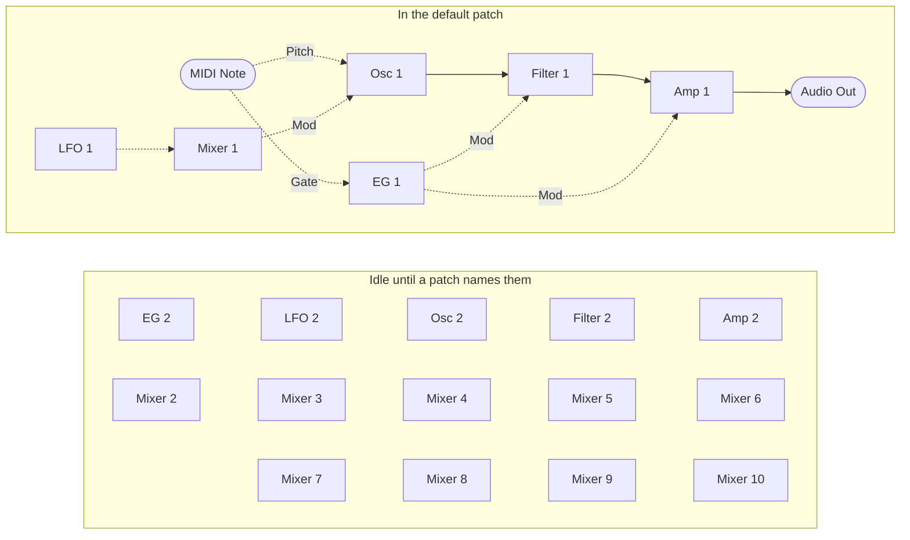

MIDI Synthesizer SPMS-1 (type-0) v0.0.27
========================================

- Monophonic semi-modular MIDI Synthesizer for Raspberry Pi Pico 2, made with Spinel (Ruby AOT Compiler)
- Controlled by MIDI as a sound module
- 48 kHz/24 bit audio output
- Developed by ISGK Instruments (Ryo Ishigaki)
- <https://github.com/risgk/midi_synthesizer_spms1>
- [日本語版 README](./README.ja.md)


Required Hardware
-----------------

- [Raspberry Pi Pico 2](https://www.raspberrypi.com/products/raspberry-pi-pico-2/)
- Pimoroni [Pico Audio Pack](https://shop.pimoroni.com/products/pico-audio-pack) (PIM544)
    - The following I2S DAC hardware (48 kHz/24 bit) can also be used:
        - [Adafruit PCM5102 I2S DAC](https://www.adafruit.com/product/6250) (Product ID: 6250)
        - GY-PCM5102 (PCM5102A I2S DAC Module)


Required Software for Modification
----------------------------------

- [Arduino IDE](https://www.arduino.cc/en/software)
- Arduino-Pico = Raspberry Pi Pico/RP2040/RP2350 (by Earle F. Philhower, III) core
    - Additional Board Manager URL: <https://github.com/earlephilhower/arduino-pico/releases/download/global/package_rp2040_index.json>
    - This sketch is tested with version 6.0.0: <https://github.com/earlephilhower/arduino-pico/releases/tag/6.0.0>
    - Info: <https://github.com/earlephilhower/arduino-pico>
- Arduino MIDI Library (by Francois Best, lathoub)
    - This sketch is tested with version 5.0.2: <https://github.com/FortySevenEffects/arduino_midi_library/releases/tag/5.0.2>
    - Info: <https://github.com/FortySevenEffects/arduino_midi_library>
- Spinel
    - Commit: <https://github.com/matz/spinel/tree/5af61ae7d53e36ca59a8de5870f532360d88fd7c>
    - Please modify `int main(int argc,char**argv){` to `int Spms1_main(int argc,char**argv){` in the Spinel output file "spms1_main.c"


Usage
-----

### Prebuilt Binary

- "spms1_type0.ino.uf2" (in the "bin" folder) is for Raspberry Pi Pico 2 and Pimoroni Pico Audio Pack


### Web Editor

- Cross-platform web-based parameter controller via Web MIDI API: "spms1_editor.html"
- Built-in software keyboard for note input and testing


### MIDI Settings

- MIDI Channel: Channel 1
- USB MIDI Input
    - Manufacturer Descriptor: "ISGK Instruments"
    - Device Name: "SPMS-1 (type-0)"
- UART MIDI Input
    - Speed: 31250 bps
    - GP4 and GP5 pins are used by UART1 TX and UART1 RX
    - You can also use `SoftwareSerial` by making the following changes:

        ```cpp
        #include <SoftwareSerial.h>
        #define SPMS1_UART_MIDI_TX_PIN              (4)
        #define SPMS1_UART_MIDI_RX_PIN              (5)
        SoftwareSerial mySerial(SPMS1_UART_MIDI_RX_PIN, SPMS1_UART_MIDI_TX_PIN);
        #define SPMS1_UART_MIDI_SERIAL              mySerial
        ```

        ```cpp
        //  SPMS1_UART_MIDI_SERIAL.setTX(SPMS1_UART_MIDI_TX_PIN);
        //  SPMS1_UART_MIDI_SERIAL.setRX(SPMS1_UART_MIDI_RX_PIN);
        ```

    - DIN/TRS MIDI is available by using (and modifying) Adafruit MIDI FeatherWing Kit, for example
        - Adafruit [MIDI FeatherWing Kit](https://www.adafruit.com/product/4740) (Product ID: 4740)
        - M5Stack [Midi Unit with DIN Connector (SAM2695)](https://shop.m5stack.com/products/midi-unit-with-din-connector-sam2695) (SKU: U187) in Separate mode
        - Kinoshita Laboratory [MIDI-UART interface-san Kit](https://www.tindie.com/products/kinoshitalab/midi-uart-interface-san-kit/)
        - 木下研究所 [MIDI-UARTインターフェースさん キット](https://www.switch-science.com/products/8117) (Shipping to Japan only)
        - necobit電子 [MIDI Unit for GROVE](https://necobit.com/denshi/grove-midi-unit/) (Shipping to Japan only)
        - necobit電子 [MIDI Unit Mini for GROVE](https://necobit.com/denshi/midi-unit-mini-for-grove/) (Shipping to Japan only)


### [MIDI Implementation Chart](./spms1_midi_chart.md)


### Block Diagram

The default patch. Solid arrows carry audio, dashed arrows carry control.


The modules run in the order EG 1, LFO 1, Mixer 1, Osc 1, Filter 1, Amp 1, one sample at a time.
Their parameters -- waveform, cutoff, gain and the rest -- arrive from CC and are left out here.

Mixer 1 is in the vibrato path to scale the LFO down to 0.2. Osc Mod Amt spans the whole pitch
range, as every modulation depth here does, so bringing a source down to a musical depth is left
to a mixer rather than built into the oscillator.

None of this is fixed. NRPN rewrites the run order, every arrow above, and which CC feeds each
parameter.

#### Everything on board

The rest of the modules exist from power-on and wait for a patch to reach them. Nothing is routed
to them and no CC touches them, so they make no sound until the run order names one.



A mixer is what lets two of anything meet, and apart from Pitch Bend it is the only way to hand a
module input a signal that swings both ways. See the examples below.

### Patch Editing (NRPN)

The patch is data, and NRPN rewrites it while the synth is running: which modules run and in what
order, what feeds each module input, where each parameter takes its value from, and which CC fills
each control slot. Every module reads from a numbered signal slot and writes to one, so rewiring is
a matter of changing slot numbers.

#### Sending

- CC 99 selects the category, CC 98 the entry within it, in either order
- CC 6 (Data Entry MSB) commits the value, and takes effect on the next audio buffer
- CC 38 (Data Entry LSB) is ignored: every value here is 7-bit
- CC 101 and CC 100 (RPN select) suspend data entry, so an RPN is never taken as a patch edit.
  Send CC 99 or CC 98 again to resume
- Edits are not saved. The default patch is restored at power-on

#### Categories (CC 99)

| CC 99 | CC 98 | Sets | CC 6 value |
| ----- | ----- | ---- | ---------- |
| 0 | 0-31 | Run order, slot by slot | Module ID |
| 1 | 0-34 | What feeds a module input | Signal ID |
| 2 | 0-65 | Where a parameter takes its value | Signal ID |
| 3 | 0-65 | Which CC fills a control slot | CC number, or 0 for none |

The run order is read from slot 0 upwards and stops at the first Module ID 0, so a patch shorter
than 32 modules ends itself. It is separate from the module numbering: a module only sees the
current sample's value from something listed before it, and last sample's from something after.

In category 3, CC number 0 means the parameter has no CC. Its control slot then keeps whatever it
already holds, so the parameter can be driven by routing alone.

There are two of every sound module and ten mixers. **Only the first of each pair is in the
default run order**, along with Mixer 1; the other nine mixers are not in it at all. Everything
left out has nothing routed to it and no CC on any of its parameters, so it makes no sound and
costs nothing per sample until a patch puts it in the run order. Its parameters are still read
once a buffer either way. Those control slots are seeded with the values the wired-up ones
default to, so a module brought into a patch behaves like its twin rather than starting silent.

#### Entries (CC 98), category 1

| CC 98 | Module input | | CC 98 | Module input | | CC 98 | Module input |
| ----- | ------ | - | ----- | ------ | - | ----- | ------ |
| 0 | EG 1 Gate | | 12 | Amp 2 Audio In | | 24 | Mixer 6 In 1 |
| 1 | EG 2 Gate | | 13 | Amp 2 Mod In | | 25 | Mixer 6 In 2 |
| 2 | Osc 1 Pitch | | 14 | Mixer 1 In 1 | | 26 | Mixer 7 In 1 |
| 3 | Osc 1 Mod In | | 15 | Mixer 1 In 2 | | 27 | Mixer 7 In 2 |
| 4 | Osc 2 Pitch | | 16 | Mixer 2 In 1 | | 28 | Mixer 8 In 1 |
| 5 | Osc 2 Mod In | | 17 | Mixer 2 In 2 | | 29 | Mixer 8 In 2 |
| 6 | Filter 1 Audio In | | 18 | Mixer 3 In 1 | | 30 | Mixer 9 In 1 |
| 7 | Filter 1 Mod In | | 19 | Mixer 3 In 2 | | 31 | Mixer 9 In 2 |
| 8 | Filter 2 Audio In | | 20 | Mixer 4 In 1 | | 32 | Mixer 10 In 1 |
| 9 | Filter 2 Mod In | | 21 | Mixer 4 In 2 | | 33 | Mixer 10 In 2 |
| 10 | Amp 1 Audio In | | 22 | Mixer 5 In 1 | | 34 | Final Output |
| 11 | Amp 1 Mod In | | 23 | Mixer 5 In 2 | |  |  |

Most of these take what their name suggests, but three do not say it on their face. A Gate is a
threshold rather than a level: an envelope triggers as the signal crosses 0.5 and releases as it
falls back. A Pitch is -0.5 to +0.5 across MIDI notes 0 to 120, so 0.0 is note 60 and a tenth of
a unit is an octave. And a Mod In is taken as it arrives: nothing is held to a range on the way
in, and what gets clamped is the value the module ends up with -- cutoff to 0.0 and 1.0, pitch
to -0.5 and +0.5. A mixer adds without a ceiling, so a loud modulation pins its destination at
one end rather than being trimmed on the way in. The amp is the exception, and holds its
modulation input to -1.0 and +1.0: it is an attenuator, so a modulation may scale its gain down
but never up.

#### Entries (CC 98), categories 2 and 3

| CC 98 | Parameter | | CC 98 | Parameter | | CC 98 | Parameter |
| ----- | ------ | - | ----- | ------ | - | ----- | ------ |
| 0 | Osc 1 Wave | | 22 | EG 2 Decay | | 44 | Mixer 5 Level 2 |
| 1 | Osc 1 Mod Amt | | 23 | EG 2 Sustain | | 45 | Mixer 5 Invert 2 |
| 2 | Osc 1 Coarse Tune | | 24 | LFO 1 Rate | | 46 | Mixer 6 Level 1 |
| 3 | Osc 1 Fine Tune | | 25 | LFO 2 Rate | | 47 | Mixer 6 Invert 1 |
| 4 | Osc 2 Wave | | 26 | Mixer 1 Level 1 | | 48 | Mixer 6 Level 2 |
| 5 | Osc 2 Mod Amt | | 27 | Mixer 1 Invert 1 | | 49 | Mixer 6 Invert 2 |
| 6 | Osc 2 Coarse Tune | | 28 | Mixer 1 Level 2 | | 50 | Mixer 7 Level 1 |
| 7 | Osc 2 Fine Tune | | 29 | Mixer 1 Invert 2 | | 51 | Mixer 7 Invert 1 |
| 8 | Filter 1 Cutoff | | 30 | Mixer 2 Level 1 | | 52 | Mixer 7 Level 2 |
| 9 | Filter 1 Resonance | | 31 | Mixer 2 Invert 1 | | 53 | Mixer 7 Invert 2 |
| 10 | Filter 1 Mod Amt | | 32 | Mixer 2 Level 2 | | 54 | Mixer 8 Level 1 |
| 11 | Filter 1 Gain | | 33 | Mixer 2 Invert 2 | | 55 | Mixer 8 Invert 1 |
| 12 | Filter 2 Cutoff | | 34 | Mixer 3 Level 1 | | 56 | Mixer 8 Level 2 |
| 13 | Filter 2 Resonance | | 35 | Mixer 3 Invert 1 | | 57 | Mixer 8 Invert 2 |
| 14 | Filter 2 Mod Amt | | 36 | Mixer 3 Level 2 | | 58 | Mixer 9 Level 1 |
| 15 | Filter 2 Gain | | 37 | Mixer 3 Invert 2 | | 59 | Mixer 9 Invert 1 |
| 16 | Amp 1 Gain | | 38 | Mixer 4 Level 1 | | 60 | Mixer 9 Level 2 |
| 17 | Amp 2 Gain | | 39 | Mixer 4 Invert 1 | | 61 | Mixer 9 Invert 2 |
| 18 | EG 1 Attack | | 40 | Mixer 4 Level 2 | | 62 | Mixer 10 Level 1 |
| 19 | EG 1 Decay | | 41 | Mixer 4 Invert 2 | | 63 | Mixer 10 Invert 1 |
| 20 | EG 1 Sustain | | 42 | Mixer 5 Level 1 | | 64 | Mixer 10 Level 2 |
| 21 | EG 2 Attack | | 43 | Mixer 5 Invert 1 | | 65 | Mixer 10 Invert 2 |

#### Module IDs

| ID | Module | | ID | Module |
| ----- | ------ | - | ----- | ------ |
| 0 | None (ends the run order) | | 11 | Mixer 1 |
| 1 | EG 1 | | 12 | Mixer 2 |
| 2 | EG 2 | | 13 | Mixer 3 |
| 3 | LFO 1 | | 14 | Mixer 4 |
| 4 | LFO 2 | | 15 | Mixer 5 |
| 5 | Osc 1 | | 16 | Mixer 6 |
| 6 | Osc 2 | | 17 | Mixer 7 |
| 7 | Filter 1 | | 18 | Mixer 8 |
| 8 | Filter 2 | | 19 | Mixer 9 |
| 9 | Amp 1 | | 20 | Mixer 10 |
| 10 | Amp 2 | |  |  |

#### Signal IDs

| ID | Signal | | ID | Signal | | ID | Signal |
| ----- | ------ | - | ----- | ------ | - | ----- | ------ |
| 0 | None (constant 0.0) | | 32 | Osc 2 Fine Tune | | 64 | Mixer 4 Invert 1 |
| 1 | Constant 1.0 | | 33 | Filter 1 Cutoff | | 65 | Mixer 4 Level 2 |
| 2 | Constant 0.5 | | 34 | Filter 1 Resonance | | 66 | Mixer 4 Invert 2 |
| 3 | Constant -0.5 | | 35 | Filter 1 Mod Amt | | 67 | Mixer 5 Level 1 |
| 4 | Constant -1.0 | | 36 | Filter 1 Gain | | 68 | Mixer 5 Invert 1 |
| 5 | EG 1 Output | | 37 | Filter 2 Cutoff | | 69 | Mixer 5 Level 2 |
| 6 | EG 2 Output | | 38 | Filter 2 Resonance | | 70 | Mixer 5 Invert 2 |
| 7 | LFO 1 Output ± | | 39 | Filter 2 Mod Amt | | 71 | Mixer 6 Level 1 |
| 8 | LFO 2 Output ± | | 40 | Filter 2 Gain | | 72 | Mixer 6 Invert 1 |
| 9 | Osc 1 Output ± | | 41 | Amp 1 Gain | | 73 | Mixer 6 Level 2 |
| 10 | Osc 2 Output ± | | 42 | Amp 2 Gain | | 74 | Mixer 6 Invert 2 |
| 11 | Filter 1 Output ± | | 43 | EG 1 Attack | | 75 | Mixer 7 Level 1 |
| 12 | Filter 2 Output ± | | 44 | EG 1 Decay | | 76 | Mixer 7 Invert 1 |
| 13 | Amp 1 Output ± | | 45 | EG 1 Sustain | | 77 | Mixer 7 Level 2 |
| 14 | Amp 2 Output ± | | 46 | EG 2 Attack | | 78 | Mixer 7 Invert 2 |
| 15 | Mixer 1 Output ± | | 47 | EG 2 Decay | | 79 | Mixer 8 Level 1 |
| 16 | Mixer 2 Output ± | | 48 | EG 2 Sustain | | 80 | Mixer 8 Invert 1 |
| 17 | Mixer 3 Output ± | | 49 | LFO 1 Rate | | 81 | Mixer 8 Level 2 |
| 18 | Mixer 4 Output ± | | 50 | LFO 2 Rate | | 82 | Mixer 8 Invert 2 |
| 19 | Mixer 5 Output ± | | 51 | Mixer 1 Level 1 | | 83 | Mixer 9 Level 1 |
| 20 | Mixer 6 Output ± | | 52 | Mixer 1 Invert 1 | | 84 | Mixer 9 Invert 1 |
| 21 | Mixer 7 Output ± | | 53 | Mixer 1 Level 2 | | 85 | Mixer 9 Level 2 |
| 22 | Mixer 8 Output ± | | 54 | Mixer 1 Invert 2 | | 86 | Mixer 9 Invert 2 |
| 23 | Mixer 9 Output ± | | 55 | Mixer 2 Level 1 | | 87 | Mixer 10 Level 1 |
| 24 | Mixer 10 Output ± | | 56 | Mixer 2 Invert 1 | | 88 | Mixer 10 Invert 1 |
| 25 | Osc 1 Wave | | 57 | Mixer 2 Level 2 | | 89 | Mixer 10 Level 2 |
| 26 | Osc 1 Mod Amt | | 58 | Mixer 2 Invert 2 | | 90 | Mixer 10 Invert 2 |
| 27 | Osc 1 Coarse Tune | | 59 | Mixer 3 Level 1 | | 91 | Note Pitch ± |
| 28 | Osc 1 Fine Tune | | 60 | Mixer 3 Invert 1 | | 92 | Note Gate |
| 29 | Osc 2 Wave | | 61 | Mixer 3 Level 2 | | 93 | Pitch Bend ± |
| 30 | Osc 2 Mod Amt | | 62 | Mixer 3 Invert 2 | |  |  |
| 31 | Osc 2 Coarse Tune | | 63 | Mixer 4 Level 1 | |  |  |

A **±** marks a signal that swings both ways: a module output reaches -0.5 and +0.5 at full
scale, and a mixer's output reaches whatever its two inputs add up to. Everything unmarked runs
0.0 to 1.0 -- an envelope's output, Note Gate, and every control slot. The bus carries both
kinds under one numbering, so the range belongs to the slot rather than to the sort of thing
that wrote it.

Slots 25-90 hold the values arriving from CC, each a ratio in 0.0 to 1.0, so a parameter reads
its own CC by default. Pointing it at another slot is what makes a modulation. Anything with no
CC sits at what it was seeded with until one is assigned.

Note Pitch, Note Gate and Pitch Bend are what the keyboard puts on the bus. Note Pitch carries
MIDI notes 0 to 120 as -0.5 to +0.5, the same span the oscillator reads as its whole pitch
range, and Pitch Bend is bipolar too, one unit across the whole wheel: exactly -0.5 and +0.5 at
the ends of its travel and exactly zero at the centre detent, so it can feed a module input
without a mixer to shift it. Note Gate is 0.0 or 1.0, and an envelope triggers at 0.5. Nothing
is routed to Pitch Bend by default.

Slots 0-4 are constants that nothing writes, for inputs that want a fixed value rather than a
source. Signal 0 is also what an entry nobody has set reads as, so an unrouted input is silent
rather than wired to whatever sits in the first slot. Signal 1 is the value an unmodulated input
wants: routing an amp's modulation input to it leaves the amp at full level. The negative
constants are for shifting a signal in a mixer, since a parameter clamps its own value to
0.0-1.0 and cannot take one directly.

Slot 127 is where a parameter with no CC sends its unused value. Nothing should read it.

The ID numbers are not stable across firmware versions. A patch is never saved, so a new module
type, another instance of one, or another signal may renumber everything after it. Read these
tables again after an update.

#### Ranges worth knowing

Both tune controls are centred on CC 64 and move one whole unit per CC step: Coarse Tune a
semitone, reaching 5 octaves either way, and Fine Tune a cent, reaching 60 either way. They are
summed, so any pitch is reachable.

Osc Mod Amt is a depth, not an offset, and it reaches the whole pitch range: at its top a bipolar
source swings the pitch five octaves up and five down. That is a coarse dial for vibrato, half a
semitone per CC step, which is why the default patch runs the LFO through Mixer 1 at 0.2 first. On
that path a semitone of vibrato sits at CC 14 and an octave at the top of the dial.

Filter Gain sets how hard the audio input drives the filter, which is also what decides how far
the filter runs into its own saturation. Its default of CC 64 is the level the oscillator used to
be scaled to on its own; above that the filter starts to compress the loud part of a note.

A mixer takes each input at its own level and its own polarity, then adds them. Invert runs from
unchanged at 0.0, through silence at 0.5, to negated at 1.0. Levels default to full and inverts
to zero, so a mixer with one input routed is a buffer; inverting that one input makes it an
inverter; and inverting only the second makes the mixer a subtractor. Mixer 1 is the exception,
seeded to 0.2 on both levels for the vibrato path it is wired into.

#### Examples

- Vibrato is wired by default -- LFO 1 reaches the oscillator's modulation input through Mixer 1
  -- so CC 13 sets the depth and CC 3 the rate
- Filter cutoff follows note pitch (keyboard tracking): CC 99 = 2, CC 98 = 8, CC 6 = 91
- Filter cutoff driven by the envelope instead of its CC: CC 99 = 2, CC 98 = 8, CC 6 = 5
- Filter cutoff swept by the LFO: CC 99 = 2, CC 98 = 8, CC 6 = 7 -- a parameter, so keep the rate
  low
- Amp gain and filter cutoff share one CC: CC 99 = 3, CC 98 = 16, CC 6 = 74
- Amp at full level with no envelope: CC 99 = 1, CC 98 = 11, CC 6 = 1
- Disconnect the filter's modulation input: CC 99 = 1, CC 98 = 7, CC 6 = 0
- A pitch envelope 60 cents deep: CC 99 = 2, CC 98 = 3, CC 6 = 5 points Osc 1 Fine Tune at the
  envelope, which then sweeps the tuning from 60 cents flat up to 60 cents sharp
- The envelope drives the filter harder as a note starts: CC 99 = 2, CC 98 = 11, CC 6 = 5
- Pitch swept by the envelope instead of the LFO: CC 99 = 1, CC 98 = 14, CC 6 = 5 puts EG 1 on
  Mixer 1's first input in the LFO's place, then set the depth on CC 13 -- a semitone at 14, an
  octave at 124
- A second envelope, so the filter and the amp stop sharing one: CC 99 = 0, CC 98 = 5, CC 6 = 2
  puts EG 2 in the run order, CC 99 = 1, CC 98 = 1, CC 6 = 92 gates it from the keyboard, and
  CC 99 = 1, CC 98 = 7, CC 6 = 6 hands the filter over to it
- Both oscillators into the filter, which takes a mixer of its own since Mixer 1 is spoken for.
  Run order first, so that each module reads a value made this sample: CC 99 = 0 with
  CC 98 = 4, 5, 6, 7 and CC 6 = 6, 12, 7, 9 leaves EG 1, LFO 1, Mixer 1, Osc 1, Osc 2, Mixer 2,
  Filter 1, Amp 1. Then CC 99 = 1, CC 98 = 4, CC 6 = 91 gives Osc 2 the note, CC 99 = 1 with
  CC 98 = 16 and 17, CC 6 = 9 and 10 feeds both into Mixer 2, and CC 99 = 1, CC 98 = 6,
  CC 6 = 16 sends the mix to the filter. Detune with Osc 2's Coarse or Fine Tune
- A CC that bends pitch both ways, which no parameter can do on its own. Mixer 1 already feeds
  Osc 1's modulation input, so it only has to be given something else to mix: CC 99 = 1,
  CC 98 = 14, CC 6 = 33 puts the filter cutoff's control slot on its first input in the LFO's
  place, and CC 99 = 1, CC 98 = 15, CC 6 = 3 puts the -0.5 constant on its second. Both levels
  are 0.2, so the mixer outputs the CC less a half at vibrato depth, and CC 74 now bends the
  pitch down and up around the note
- A CC that works backwards, which needs the mixer to subtract rather than add. CC 99 = 0,
  CC 98 = 6, CC 6 = 12 puts Mixer 2 in the run order, CC 99 = 1, CC 98 = 16, CC 6 = 1 puts the
  constant 1.0 on its first input, CC 99 = 1, CC 98 = 17, CC 6 = 33 puts the cutoff's control
  slot on the second, and CC 99 = 2, CC 98 = 33, CC 6 = 1 inverts that second input alone, so the
  mixer outputs one minus the CC. Point the cutoff's own source at the mixer with CC 99 = 2,
  CC 98 = 8, CC 6 = 16 and CC 74 now closes the filter as it rises
- Take the filter out of the chain: CC 99 = 0, CC 98 = 3, CC 6 = 9, then CC 99 = 0, CC 98 = 4,
  CC 6 = 0 -- and point the amp's audio input at the oscillator: CC 99 = 1, CC 98 = 10, CC 6 = 9

#### Notes

- Module inputs (category 1) are read every sample and are not smoothed; parameters (category 2)
  are read once per buffer and are smoothed by their destination. Route a fast source through a
  module input, a stepped one through a parameter
- A parameter source may point at any of the 128 slots. Slots above 93 read 0 until something
  writes them
- A parameter clamps its value to 0.0-1.0, so apart from Pitch Bend a mixer is the only way to
  give a module input a signal that swings both ways
- The NRPN CCs are stored as ordinary controls too, so a parameter may be mapped to CC 6 -- which
  then moves it every time a patch edit is sent

### Debug UART

- Speed: 115200 bps
- GP0 and GP1 pins are used by UART0 TX and UART0 RX


### Test Script

- Output WAV File: "spms1_output_wav.rb"


SPMS-1 (type-0) Licence
-----------------------

```
MIDI Synthesizer SPMS-1 (type-0) by ISGK Instruments (Ryo Ishigaki) is marked with CC0 1.0.
To view a copy of this license, visit https://creativecommons.org/publicdomain/zero/1.0/
```

- Target files: `spms1_*.*`


Spinel Licence
--------------

```
Copyright (c) 2024- Yukihiro Matsumoto (matz@ruby.or.jp)

Permission is hereby granted, free of charge, to any person obtaining a
copy of this software and associated documentation files (the "Software"),
to deal in the Software without restriction, including without limitation
the rights to use, copy, modify, merge, publish, distribute, sublicense,
and/or sell copies of the Software, and to permit persons to whom the
Software is furnished to do so, subject to the following conditions:

The above copyright notice and this permission notice shall be included in
all copies or substantial portions of the Software.

THE SOFTWARE IS PROVIDED "AS IS", WITHOUT WARRANTY OF ANY KIND, EXPRESS OR
IMPLIED, INCLUDING BUT NOT LIMITED TO THE WARRANTIES OF MERCHANTABILITY,
FITNESS FOR A PARTICULAR PURPOSE AND NONINFRINGEMENT. IN NO EVENT SHALL THE
AUTHORS OR COPYRIGHT HOLDERS BE LIABLE FOR ANY CLAIM, DAMAGES OR OTHER
LIABILITY, WHETHER IN AN ACTION OF CONTRACT, TORT OR OTHERWISE, ARISING
FROM, OUT OF OR IN CONNECTION WITH THE SOFTWARE OR THE USE OR OTHER
DEALINGS IN THE SOFTWARE.
```

- Base Commit: <https://github.com/matz/spinel/tree/5af61ae7d53e36ca59a8de5870f532360d88fd7c>
- Target files: `sp_*.*`
    - Note: Some files for runtime are modified for MCU by ISGK Instruments (Ryo Ishigaki)
