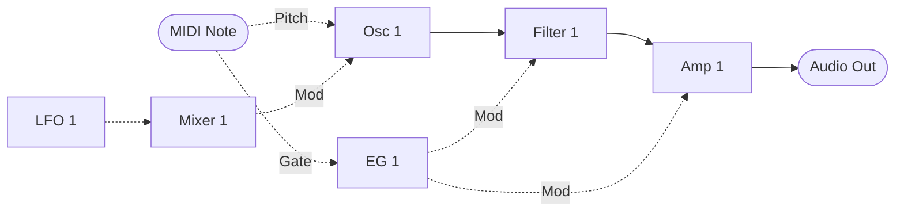
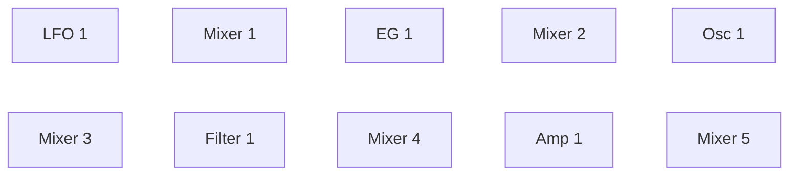

MIDI Synthesizer SPMS-1 (type-1) v0.0.3
=======================================

- Spinel (Ruby AOT コンパイラ) で作った、M5Stack AtomS3 Lite と Raspberry Pi Pico 2 用のモノフォニック・セミモジュラー MIDI シンセサイザー
- 音源モジュールとして MIDI で制御します
- 48 kHz/24 bit オーディオ出力
- フィルタ: ZDF/TPT ステート・バリアブル・フィルタ (遅延ソフトクリッピング付き)
- 開発: ISGK Instruments (Ryo Ishigaki)
- <https://github.com/risgk/midi_synthesizer_spms1>
- [English README](./README.md) (英語版が正です)


必要なハードウェア
------------------

- M5Stack AtomS3 Lite (ESP32-S3)、推奨
    - M5Stack [AtomS3 Lite](https://shop.m5stack.com/products/atoms3-lite-esp32s3-dev-kit) (SKU: C124)
    - M5Stack [Atomic Audio-3.5 Base](https://shop.m5stack.com/products/atomic-audio-3-5-base) (SKU: A166)
- Raspberry Pi Pico 2 (RP2350)
    - [Raspberry Pi Pico 2](https://www.raspberrypi.com/products/raspberry-pi-pico-2/)
    - Pimoroni [Pico Audio Pack](https://shop.pimoroni.com/products/pico-audio-pack) (PIM544)
        - 以下の I2S DAC ハードウェア (48 kHz/24 bit) も使えます:
            - [Adafruit PCM5102 I2S DAC](https://www.adafruit.com/product/6250) (Product ID: 6250)
            - GY-PCM5102 (PCM5102A I2S DAC モジュール)


改造に必要なソフトウェア
------------------------

- [Arduino IDE](https://www.arduino.cc/en/software)
- M5Stack AtomS3 Lite 用: Arduino core for the ESP32 (by Espressif Systems)
    - このスケッチはバージョン 3.3.11 で動作確認しています: <https://github.com/espressif/arduino-esp32/releases/tag/3.3.11>
    - 情報: <https://github.com/espressif/arduino-esp32>
    - ボード: "M5AtomS3"、"ツール" メニューの USB Mode: "USB-OTG (TinyUSB)"。USB MIDI、I2S、I2C は
      すべてコアのものを使うので、Arduino MIDI Library 以外のライブラリは要りません
- Raspberry Pi Pico 2 用: Arduino-Pico = Raspberry Pi Pico/RP2040/RP2350 (by Earle F. Philhower, III) コア
    - 追加のボードマネージャ URL: <https://github.com/earlephilhower/arduino-pico/releases/download/global/package_rp2040_index.json>
    - このスケッチはバージョン 6.1.1 で動作確認しています: <https://github.com/earlephilhower/arduino-pico/releases/tag/6.1.1>
    - 情報: <https://github.com/earlephilhower/arduino-pico>
    - ボード: "Raspberry Pi Pico 2"、"ツール" メニューの USB Stack: "Adafruit TinyUSB"
- Arduino MIDI Library (by Francois Best, lathoub)
    - このスケッチはバージョン 5.0.2 で動作確認しています: <https://github.com/FortySevenEffects/arduino_midi_library/releases/tag/5.0.2>
    - 情報: <https://github.com/FortySevenEffects/arduino_midi_library>
- Spinel
    - コミット: <https://github.com/matz/spinel/tree/5af61ae7d53e36ca59a8de5870f532360d88fd7c>
    - Spinel の出力ファイル "spms1_main.c" に手を入れる必要はありません。本スケッチの "sp_runtime.h" が
      ESP32-S3 向けに `#define main IRAM_ATTR __attribute__((flatten)) Spms1_main`、RP2350 向けに
      `#define main __attribute__((section(".time_critical"), flatten)) Spms1_main` を持っており、改名と
      シンセ本体の RAM 配置 (ESP32-S3 では IRAM) を同時に行います。手で改名すると、このマクロが一致しなく
      なって属性が付かず、本体が flash から実行されます


使い方
------

### ビルド済みバイナリ

- "bin" フォルダの "spms1_type1.ino.merged.bin" は M5Stack AtomS3 Lite と Atomic Audio-3.5 Base 用です
    - AtomS3 Lite のリセットボタンを、内部の緑色 LED が点くまで約 2 秒長押しして、ダウンロードモードに
      します。そのうえで、たとえば esptool (Arduino core for the ESP32 に同梱) で、アドレス 0x0 に
      書き込みます:

        ```
        esptool --chip esp32s3 --port COM7 write-flash 0x0 spms1_type1.ino.merged.bin
        ```

    - インストール不要の方法として、Chrome か Edge で [esptool-js](https://espressif.github.io/esptool-js/)
      を開き、AtomS3 Lite に "Connect" して、Flash Address 0x0 にファイルを "Program" することもできます
    - 書き込んだら、USB ケーブルを抜き差しして起動してください。書き込みの最後に行われるリセットでは、
      ダウンロードモードのままになります


### Web エディタ

- Web MIDI API を使う、プラットフォームを問わないパラメータ・コントローラ: "spms1_editor.html"
- 音を出して試すためのソフトウェア鍵盤を内蔵しています
- グラフィカルなパッチエディタ（実験的）: "spms1_patch_editor.html"
    - モジュールの出力を入力やパラメータへ配線し、実行順と CC の割り当てを設定します
    - パッチを JSON で保存・読み込みします
    - パッチを MIDI バイト列または NRPN リストとしてコピーするか、Web MIDI で送信します


### MIDI の設定

- MIDI チャンネル: チャンネル 1
- USB MIDI 入力
    - 製造者ディスクリプタ: "ISGK Instruments" (Raspberry Pi Pico 2 のみ。AtomS3 Lite では USB CDC On Boot が
      スケッチより先に USB を起動するので設定できず、コア既定のままです)
    - デバイス名: "SPMS-1 (type-1)"
    - Windows では、AtomS3 Lite の MIDI インターフェースに "USB JTAG debug unit" ドライバ (WinUSB) が
      割り当てられることがあります。ESP32 のツールによっては、Hardware CDC モードの同じ VID/PID 向けに
      このドライバを入れるためです。その場合 MIDI デバイスとして現れないので、デバイスマネージャーで
      ドライバを "USB オーディオ デバイス" に変更してください
- UART MIDI 入力
    - 速度: 31250 bps
    - M5Stack AtomS3 Lite: G2 ピンと G1 ピン (Grove ポート) を UART2 TX と UART2 RX に使います
        - M5Stack [Unit MIDI](https://shop.m5stack.com/products/midi-unit-with-din-connector-sam2695)
          (SKU: U187) を Grove ポートに直接つなげば、DIN MIDI インターフェースとして使えます (セパレートモード)
        - AtomS3 Lite 自体を Grove ユニットとして、別の M5Stack コントローラから Grove ポート経由で
          鳴らす場合は、2 つのピンを入れ替えてください:

            ```cpp
            #define SPMS1_UART_MIDI_TX_PIN              (1)     // Grove
            #define SPMS1_UART_MIDI_RX_PIN              (2)     // Grove
            ```

    - Raspberry Pi Pico 2: GP4 ピンと GP5 ピンを UART1 TX と UART1 RX に使います
    - Raspberry Pi Pico 2 では、以下のように書き換えれば `SoftwareSerial` も使えます:

        ```cpp
        #include <SoftwareSerial.h>
        #define SPMS1_UART_MIDI_TX_PIN              (4)
        #define SPMS1_UART_MIDI_RX_PIN              (5)
        SoftwareSerial mySerial(SPMS1_UART_MIDI_RX_PIN, SPMS1_UART_MIDI_TX_PIN);
        #define SPMS1_UART_MIDI_SERIAL              mySerial
        ```

        ```cpp
        //  SPMS1_UART_MIDI_SERIAL.setTX(SPMS1_UART_MIDI_TX_PIN);
        //  SPMS1_UART_MIDI_SERIAL.setRX(SPMS1_UART_MIDI_RX_PIN);
        ```

    - DIN/TRS MIDI は、たとえば Adafruit MIDI FeatherWing Kit などを使う (そして手を入れる) ことで利用できます
        - Adafruit [MIDI FeatherWing Kit](https://www.adafruit.com/product/4740) (Product ID: 4740)
        - M5Stack [Midi Unit with DIN Connector (SAM2695)](https://shop.m5stack.com/products/midi-unit-with-din-connector-sam2695) (SKU: U187) のセパレートモード
        - Kinoshita Laboratory [MIDI-UART interface-san Kit](https://www.tindie.com/products/kinoshitalab/midi-uart-interface-san-kit/)
        - 木下研究所 [MIDI-UARTインターフェースさん キット](https://www.switch-science.com/products/8117) (日本国内発送のみ)
        - necobit電子 [MIDI Unit for GROVE](https://necobit.com/denshi/grove-midi-unit/) (日本国内発送のみ)
        - necobit電子 [MIDI Unit Mini for GROVE](https://necobit.com/denshi/midi-unit-mini-for-grove/) (日本国内発送のみ)


### レイテンシ

MIDI メッセージを受けてから音が出るまで、およそ 4 ms です。

- 64 サンプルの出力バッファが 2 つ: 2.7 ms
- MIDI はバッファごとに 1 回読むので、最大でもう 1 つ分待ちます: 1.3 ms

これはシンセ自身の分で、MIDI の伝送と DAC の分はこの上に乗ります。


### [MIDI インプリメンテーション・チャート](./spms1_midi_chart.md)


### ブロック図

デフォルトのパッチです。実線の矢印がオーディオ信号を、破線の矢印がコントロール信号を運びます。



モジュールは下の実行順で、1 サンプルずつ処理されます。波形やカットオフ、ゲインといったパラメータは CC
から届くもので、この図では省いています。

Mixer 1 がビブラートの経路に入っているのは、LFO を 0.2 倍に落とすためです。Osc 1 Mod Amt はここにある
どのモジュレーション深度とも同じくピッチの全域に届くので、ソースを音楽的な深さまで絞る仕事はオシレータに
作り込まず、ミキサーに任せています。

以上はどれも固定ではありません。実行順も、上の図のすべての矢印も、どの CC がどのパラメータに入るかも、
NRPN が書き換えます。

#### 実行順

すべてのモジュールが入っています。音を作る型が 1 つずつと、そのそれぞれの後ろに 1 つずつのミキサーです。



Mixer 2 から 5 には何も結線されていないので、毎サンプル自分のスロットぶんのコストを払うだけで、パッチが
何かを与えるまでは何も変えません。どこに座っているかがそのまま価値になります。あるモジュールが今サンプル
の値を見られるのは、この列で自分より前にあるものからだけで、後ろにあるものからは前サンプルの値を受け取り
ます。Mixer 1 は LFO に、Mixer 3 はオシレータに手が届く、という具合です。

ミキサーは 2 つの信号を合流させるための道具であり、エンベロープのように片側にしか振れない信号を正負
どちらにも振れるようにする手段でもあります。下の例を参照してください。

### パッチの編集 (NRPN)

パッチはデータであり、NRPN は動いているシンセのそれを書き換えます。どのモジュールがどの順で走るか、各
モジュール入力に何が入るか、各パラメータがどこから値を取るか、どの CC がどのコントロールスロットを埋める
か。すべてのモジュールは番号の付いたシグナルスロットから読み、番号の付いたスロットへ書くので、配線し直す
こととはスロット番号を変えることです。

#### 送り方

- CC 99 でカテゴリを、CC 98 でその中のエントリを選びます。順序はどちらが先でも構いません
- CC 6 (Data Entry MSB) で値が確定し、次のオーディオバッファから効きます
- CC 38 (Data Entry LSB) は無視されます。ここで扱う値はすべて 7 ビットです
- CC 101 と CC 100 (RPN セレクト) はデータ入力を中断させるので、RPN がパッチ編集と取り違えられることは
  ありません。再開するには CC 99 か CC 98 をもう一度送ります
- 編集内容は保存されません。電源投入時にデフォルトのパッチへ戻ります

#### カテゴリ (CC 99)

| CC 99 | CC 98 | 設定する対象 | CC 6 の値 |
| ----- | ----- | ---- | ---------- |
| 0 | 0-31 | 実行順、スロットごとに | モジュール ID |
| 1 | 0-17 | モジュール入力に何を入れるか | シグナル ID |
| 2 | 0-32 | パラメータがどこから値を取るか | シグナル ID |
| 3 | 0-40 | どの CC がコントロールスロットを埋めるか | CC 番号、0 なら割り当てなし |

実行順はスロット 0 から上へ読まれ、最初に現れたモジュール ID 0 で止まります。32 個に満たないパッチは
そこで自ら終わるわけです。実行順はモジュールの番号付けとは別物です。あるモジュールが今サンプルの値を
見られるのは自分より前に並んでいるものからだけで、後ろにあるものからは前サンプルの値を受け取ります。

カテゴリ 3 で CC 番号 0 を指定すると、そのパラメータには CC がない状態になります。コントロールスロットは
そのとき持っている値をそのまま保つので、パラメータをルーティングだけで動かせます。

音を作るモジュールは 1 つずつ、ミキサーは 5 つあり、**この 10 個すべてがデフォルトの実行順に入っています**。
パッチは結線するだけでよく、何かを先に有効化する必要はありません。どのパラメータにも CC が付いていないのは
ミキサーだけで、そのぶんコントロールスロットに初期値を入れてあります。レベルは最大、反転はなしなので、
入力を 1 つ結線したミキサーはそれをそのまま通します。Mixer 1 だけはレベル 0.2 です。デフォルトのパッチが
LFO をそこに通すからです。

#### エントリ (CC 98)、カテゴリ 1

| CC 98 | モジュール入力 | | CC 98 | モジュール入力 |
| ----- | ------ | - | ----- | ------ |
| 0 | EG 1 Gate | | 9 | Mixer 2 In 1 |
| 1 | Osc 1 Pitch | | 10 | Mixer 2 In 2 |
| 2 | Osc 1 Mod In | | 11 | Mixer 3 In 1 |
| 3 | Filter 1 Audio In | | 12 | Mixer 3 In 2 |
| 4 | Filter 1 Mod In | | 13 | Mixer 4 In 1 |
| 5 | Amp 1 Audio In | | 14 | Mixer 4 In 2 |
| 6 | Amp 1 Mod In | | 15 | Mixer 5 In 1 |
| 7 | Mixer 1 In 1 | | 16 | Mixer 5 In 2 |
| 8 | Mixer 1 In 2 | | 17 | 最終出力 |

ほとんどは名前のとおりのものを受け取りますが、3 つだけ名前からは分からない決まりがあります。Gate はレベル
ではなく閾値で、信号が 0.5 を越えるとエンベロープがトリガし、下回るとリリースします。Pitch は MIDI ノート
0〜120 を -0.5〜+0.5 で表すので、0.0 がノート 60、0.1 が 1 オクターブです。そして Mod In は届いたままの値を
受け取ります。入口では何も制限せず、クランプされるのはモジュールが最終的に得た値のほうです。カットオフは
つまみの両端、ピッチは -0.5〜+0.5 に収まります。ミキサーは上限なしで足し算をするので、大きすぎる変調は入口で
削られるのではなく、行き先を端に貼り付かせます。アンプだけは例外で、Mod In を -1.0〜+1.0 でクランプします。
アンプはアッテネーターなので、変調はゲインを下げられても上げられてはならないからです。

#### エントリ (CC 98)、カテゴリ 2 と 3

| CC 98 | パラメータ | | CC 98 | パラメータ | | CC 98 | パラメータ |
| ----- | ------ | - | ----- | ------ | - | ----- | ------ |
| 0 | Osc 1 Wave | | 11 | EG 1 Sustain | | 22 | Mixer 3 Invert 1 |
| 1 | Osc 1 Mod Amt | | 12 | LFO 1 Rate | | 23 | Mixer 3 Level 2 |
| 2 | Osc 1 Coarse Tune | | 13 | Mixer 1 Level 1 | | 24 | Mixer 3 Invert 2 |
| 3 | Osc 1 Fine Tune | | 14 | Mixer 1 Invert 1 | | 25 | Mixer 4 Level 1 |
| 4 | Filter 1 Cutoff | | 15 | Mixer 1 Level 2 | | 26 | Mixer 4 Invert 1 |
| 5 | Filter 1 Resonance | | 16 | Mixer 1 Invert 2 | | 27 | Mixer 4 Level 2 |
| 6 | Filter 1 Mod Amt | | 17 | Mixer 2 Level 1 | | 28 | Mixer 4 Invert 2 |
| 7 | Filter 1 Gain | | 18 | Mixer 2 Invert 1 | | 29 | Mixer 5 Level 1 |
| 8 | Amp 1 Gain | | 19 | Mixer 2 Level 2 | | 30 | Mixer 5 Invert 1 |
| 9 | EG 1 Attack | | 20 | Mixer 2 Invert 2 | | 31 | Mixer 5 Level 2 |
| 10 | EG 1 Decay | | 21 | Mixer 3 Level 1 | | 32 | Mixer 5 Invert 2 |

#### エントリ (CC 98)、カテゴリ 3 のみ

これらのスロットはどのパラメータにも属さないので、カテゴリ 2 には対応するエントリがありません。後述の
General スロットを参照してください。

| CC 98 | コントロールスロット | | CC 98 | コントロールスロット |
| ----- | ------ | - | ----- | ------ |
| 33 | General Unipolar 1 | | 37 | General Bipolar 1 |
| 34 | General Unipolar 2 | | 38 | General Bipolar 2 |
| 35 | General Unipolar 3 | | 39 | General Bipolar 3 |
| 36 | General Unipolar 4 | | 40 | General Bipolar 4 |

#### モジュール ID

| ID | モジュール |
| ----- | ------ |
| 0 | なし（実行順の終端） |
| 1 | LFO 1 |
| 2 | EG 1 |
| 3 | Osc 1 |
| 4 | Filter 1 |
| 5 | Amp 1 |
| 6 | Mixer 1 |
| 7 | Mixer 2 |
| 8 | Mixer 3 |
| 9 | Mixer 4 |
| 10 | Mixer 5 |

#### シグナル ID

| ID | シグナル | | ID | シグナル | | ID | シグナル |
| ----- | ------ | - | ----- | ------ | - | ----- | ------ |
| 0 | なし（定数 0.0） | | 20 | Filter 1 Resonance | | 40 | Mixer 4 Level 1 |
| 1 | 定数 1.0 | | 21 | Filter 1 Mod Amt | | 41 | Mixer 4 Invert 1 |
| 2 | 定数 0.5 | | 22 | Filter 1 Gain | | 42 | Mixer 4 Level 2 |
| 3 | 定数 -0.5 | | 23 | Amp 1 Gain | | 43 | Mixer 4 Invert 2 |
| 4 | 定数 -1.0 | | 24 | EG 1 Attack | | 44 | Mixer 5 Level 1 |
| 5 | LFO 1 Output ± | | 25 | EG 1 Decay | | 45 | Mixer 5 Invert 1 |
| 6 | EG 1 Output | | 26 | EG 1 Sustain | | 46 | Mixer 5 Level 2 |
| 7 | Osc 1 Output ± | | 27 | LFO 1 Rate | | 47 | Mixer 5 Invert 2 |
| 8 | Filter 1 Output ± | | 28 | Mixer 1 Level 1 | | 48 | Note Pitch ± |
| 9 | Amp 1 Output ± | | 29 | Mixer 1 Invert 1 | | 49 | Note Gate |
| 10 | Mixer 1 Output ± | | 30 | Mixer 1 Level 2 | | 50 | Pitch Bend ± |
| 11 | Mixer 2 Output ± | | 31 | Mixer 1 Invert 2 | | 51 | General Unipolar 1 |
| 12 | Mixer 3 Output ± | | 32 | Mixer 2 Level 1 | | 52 | General Unipolar 2 |
| 13 | Mixer 4 Output ± | | 33 | Mixer 2 Invert 1 | | 53 | General Unipolar 3 |
| 14 | Mixer 5 Output ± | | 34 | Mixer 2 Level 2 | | 54 | General Unipolar 4 |
| 15 | Osc 1 Wave | | 35 | Mixer 2 Invert 2 | | 55 | General Bipolar 1 ± |
| 16 | Osc 1 Mod Amt | | 36 | Mixer 3 Level 1 | | 56 | General Bipolar 2 ± |
| 17 | Osc 1 Coarse Tune ± | | 37 | Mixer 3 Invert 1 | | 57 | General Bipolar 3 ± |
| 18 | Osc 1 Fine Tune ± | | 38 | Mixer 3 Level 2 | | 58 | General Bipolar 4 ± |
| 19 | Filter 1 Cutoff | | 39 | Mixer 3 Invert 2 | |  |  |

**±** は、正負どちらにも振れるシグナルを表します。モジュール出力はフルスケールで -0.5 と +0.5 に届き、
バイポーラのコントロールスロットは -0.5〜+0.5 で、ミキサーはそれを 2 つ足して 1.0 で止まります。印のない
ものは 0.0〜1.0 で、エンベロープの出力、Note Gate、ユニポーラのコントロールスロットがこれにあたります。
バスは両方を 1 つの番号空間で運ぶので、レンジは「何が書いたか」ではなくスロットごとの性質です。

スロット 15〜47 には CC から届いた値が入るので、パラメータはデフォルトでは自分の CC を読んでいるわけです。
パラメータはそれぞれユニポーラかバイポーラで、スロットも同じレンジを取ります。ユニポーラは CC 4〜124 で
0.0〜1.0 と、エンベロープと同じ幅なので、エンベロープを向ければつまみの全域を動かせます。バイポーラは
CC 64 を 0.0 とする -0.5〜+0.5 と、LFO と同じ幅なので、バイポーラのソースを向ければ中央を挟んで上下に
振れます。バイポーラなのは 2 つのチューンだけで、中央が「変化なし」を意味するからです。パラメータに別の
スロットを指させることがモジュレーションになります。CC のないものは、割り当てられるまで初期値のままです。

スロット 51〜58 の General スロットは、どのパラメータにも属さないコントロールスロットです。CC をバスに
載せるだけで、どのモジュール入力やパラメータからも読めます。General Unipolar 1〜4 は 0.0〜1.0、General
Bipolar 1〜4 は -0.5〜+0.5 です。どちらもデフォルトでは CC 16〜19 を読むので、それぞれの CC が両方の形で
同時に届きます。起動時はどちらも CC 64 で、ユニポーラは 0.5、バイポーラは 0.0 です。

Note Pitch、Note Gate、Pitch Bend の 3 つは鍵盤がバスに載せるものです。Note Pitch は MIDI ノート 0〜120 を
-0.5〜+0.5 で運びます。オシレータがピッチの全域として読むのと同じ幅です。Pitch Bend も同じくバイポーラで、
ホイールの端から端までがちょうど 1 単位で、両端がちょうど -0.5 と +0.5、中央のディテントがちょうど 0 に
なるので、ミキサーで下駄を履かせなくてもモジュール入力へ入れられます。Note Gate は 0.0 か 1.0 で、
エンベロープは 0.5 以上でトリガします。Pitch Bend はデフォルトではどこにも結線されていません。

スロット 0〜4 は何も書き込まない定数で、ソースではなく固定値を入れたい入力のためにあります。シグナル 0 は
誰も設定していないエントリが読む値でもあるので、未結線の入力は最初のスロットに入っているものに繋がるので
はなく、無音になります。シグナル 1 はモジュレーションのかかっていない入力が欲しがる値で、アンプの
モジュレーション入力をここへ向ければアンプはフルレベルのままです。シグナル 0 と 1 はユニポーラの、
シグナル 3 と 2 はバイポーラのパラメータのレンジの両端なので、パラメータをそこに固定するのに使えます。
シグナル 2 はユニポーラのつまみの中央でもあります。ミキサーの 2 番目の入力に定数を置けば、信号を 2 種類の
間でずらせます。-0.5 なら片側にしか振れない信号を正負どちらにも振れるものへ、+0.5 ならその逆です。

スロット 127 は、CC のないパラメータが使われない値を捨てる先です。ここを読ませてはいけません。

ID 番号はファームウェアのバージョンをまたいで安定ではありません。パッチは保存されないので、モジュールの
種類が増えたり、あるモジュールのインスタンスが増えたり、シグナルが増えたりすると、それ以降がすべて振り
直されることがあります。アップデート後はこれらの表を読み直してください。

#### 知っておきたいレンジ

2 つのチューンはどちらも CC 64 を中心とし、CC 1 ステップでちょうど 1 単位動きます。Coarse Tune は半音で
上下 5 オクターブまで、Fine Tune は 1 セントで上下 60 セントまでです。両者は加算されるので、どのピッチにも
届きます。

Osc 1 Mod Amt はオフセットではなく深さで、ピッチの全域に届きます。最大にすると、バイポーラのソースがピッチ
を 5 オクターブ上下に振ります。ビブラートのつまみとしては CC 1 ステップが 50 セントと粗いので、デフォルト
のパッチでは LFO をまず Mixer 1 で 0.2 倍にしています。この経路なら半音のビブラートが CC 14、つまみの上端で
1 オクターブです。

Filter 1 Gain はオーディオ入力がフィルタをどれだけ強く駆動するかを決め、それがそのままフィルタ自身の
サチュレーションの深さにもなります。デフォルトの CC 64 は、かつてオシレータ側で掛けていたレベルにあたり
ます。それより上げると、フィルタが音の大きい部分を圧縮しはじめます。

ミキサーは各入力をそれぞれのレベルとそれぞれの極性で受け取り、足し合わせます。Level は 0.0 (CC 4) で
無音、1.0 (CC 124) で最大、Invert は 0.0 でそのまま、0.5 で無音、1.0 で反転します。レベルの初期値は
最大、Invert はそのままなので、入力を 1 つだけ結線したミキサーはバッファになります。その入力を反転させれば
インバータに、2 番目だけを反転させれば減算器になります。Mixer 1 だけは例外で、結線されているビブラート
経路に合わせて両方のレベルが 0.2 (CC 28) になっています。

和は -1.0〜+1.0 に収められます。フルスケールの信号 2 本がちょうどそこに届くので、普通の使い方では何も
切られません。止めているのは、ミキサーを自分の入力に戻した場合です。放っておけば毎サンプル 2 倍になり、
やがて数値でなくなって、オシレータやフィルタを道連れにします。フィルタも同じ 1.0 に収まりますが、
こちらは角ではなく曲線です。出力は 0.5 まではまったく手を加えずに通し（デフォルトのパッチはそこまで
届きません）、その先で滑らかに上限へ寄せます。共振のピークはスイープ中に 1.0 を超えることがあり、そこを
丸めても、角で切った場合に音の中へ折り返してくる高次の倍音よりずっと弱いもので済みます。

#### 例

- ビブラートはデフォルトで結線済みです。LFO が Mixer 1 を経てオシレータのモジュレーション入力に届くので、
  CC 13 で深さ、CC 3 でレートを決められます
- フィルタのカットオフをノートのピッチに追従させる（キーボードトラッキング）: CC 99 = 1, CC 98 = 4,
  CC 6 = 48 で、エンベロープの代わりに Note Pitch をフィルタのモジュレーション入力に置きます。カットオフが
  CC 64、Mod Amt が CC 124 なら、ノート 60 でカットオフはつまみの中央のままで、1 ノートごとに半音動きます
- フィルタのカットオフを LFO でつまみの中央を挟んで揺らす: CC 99 = 1, CC 98 = 4, CC 6 = 5。
  モジュール入力は毎サンプル読まれるので、LFO のレートはいくつでも構いません
- フィルタのカットオフを、自分の CC ではなくエンベロープで動かす: CC 99 = 2, CC 98 = 4, CC 6 = 6。
  エンベロープもカットオフもユニポーラなので、カットオフはつまみの下端から上端まで開きます
- アンプのゲインとフィルタのカットオフで 1 つの CC を共有する: CC 99 = 3, CC 98 = 8, CC 6 = 74
- エンベロープなしでアンプをフルレベルにする: CC 99 = 1, CC 98 = 6, CC 6 = 1
- フィルタのモジュレーション入力を切り離す: CC 99 = 1, CC 98 = 4, CC 6 = 0
- 深さ 60 セントのピッチエンベロープ: CC 99 = 2, CC 98 = 3, CC 6 = 6 で Osc 1 Fine Tune をエンベロープに
  向けると、チューニングが元の音程から 60 セント高いところまで動き、エンベロープのピークの半分でそこに
  届きます
- ノートの出だしでエンベロープがフィルタをより強く駆動する: CC 99 = 2, CC 98 = 7, CC 6 = 6 で、フィルタの
  入力レベルが無音からつまみの上端まで上がって戻ります
- ピッチを LFO ではなくエンベロープで動かす: CC 99 = 1, CC 98 = 7, CC 6 = 6 で LFO の代わりにエンベロープ
  を Mixer 1 の 1 番目の入力に置き、あとは CC 13 で深さを決めます -- 14 で半音、124 で 1 オクターブです
- ピッチベンド。デフォルトではどこにも結線されていません。CC 99 = 1 で CC 98 = 9 と 10 に CC 6 = 48 と 50
  を送ると Note Pitch と Pitch Bend が Mixer 2 の 2 つの入力に入り、CC 99 = 1, CC 98 = 1, CC 6 = 11 で
  その和がオシレータのピッチになります。Mixer 2 はオシレータより前を走るので、ホイールは同じサンプルで
  音程を動かします。レベルはどちらも最大なので、そのままではホイールが上下 5 オクターブ振ります。
  CC 99 = 2, CC 98 = 19, CC 6 = 51 で Mixer 2 の 2 番目のレベルを General Unipolar 1 から取るように
  すれば、CC 16 で演奏できるベンドレンジまで絞れます
- モジュレーション入力を通して、ピッチを両方向に曲げる CC。Mixer 1 はすでにオシレータのモジュレーション
  入力に繋がっているので、あとは混ぜるものを与えるだけです: CC 99 = 1, CC 98 = 7, CC 6 = 19 で LFO の
  代わりにフィルタのカットオフのコントロールスロットを 1 番目の入力に置き、CC 98 = 8, CC 6 = 3 で定数
  -0.5 を 2 番目の入力に置きます。スロットはユニポーラなので、この定数が LFO が 0 を中心とするのと同じく
  CC 64 を中心にします。レベルはどちらも 0.2 なので、CC 74 がビブラートの深さでノートの上下にピッチを
  曲げるようになります
- 逆向きに効く CC。ミキサーに反転させます。Mixer 2 はすでに走っているので、結線するだけです。
  CC 99 = 1, CC 98 = 9, CC 6 = 19 でカットオフのコントロールスロットを 1 番目の入力に、CC 98 = 10,
  CC 6 = 1 で定数 1.0 を 2 番目の入力に置き、CC 99 = 2, CC 98 = 18, CC 6 = 1 で 1 番目の入力の Invert を
  1.0、つまり反転側の端に固定すると、ミキサーは 1.0 から CC を引いた値、つまり CC を CC 64 で折り返した
  ものを出力します。CC 99 = 2, CC 98 = 4, CC 6 = 11 でカットオフ自身のソースをその
  ミキサーに向ければ、CC 74 は上げるほどフィルタを閉じるようになります
- フィルタを経路から外す: CC 99 = 1, CC 98 = 5, CC 6 = 7 でアンプのオーディオ入力をオシレータに向けます。
  フィルタは走り続けスロットも占めたままですが、誰も読みません

#### 注意点

- モジュール入力（カテゴリ 1）は毎サンプル読まれ、スムージングされません。パラメータ（カテゴリ 2）は
  1 バッファに 1 回読まれ、受け取る側でスムージングされます。速いソースはモジュール入力へ、段階的なものは
  パラメータへ通してください
- パラメータのソースは 128 のスロットのどれでも指せます。58 より上のスロットは、何かが書き込むまで 0 を
  返すので、そこを指したパラメータはユニポーラならつまみの下端、バイポーラなら中央に留まります
- パラメータは自分の値を自分のレンジ、0.0〜1.0 か -0.5〜+0.5 に丸め、コントロールスロットも同じレンジを
  バスに載せます。ユニポーラのスロットをモジュール入力に結線するとエンベロープと同じく片側にしか振れず、
  CC 64 を挟んで正負どちらにも振るにはミキサーと定数 -0.5 が要ります
- NRPN 用の CC も通常のコントロールとして保存されるので、パラメータを CC 6 に割り当てることもできます。
  その場合、パッチ編集を送るたびにそのパラメータが動きます

### デバッグ UART

- M5Stack AtomS3 Lite: USB CDC (同じケーブルで USB MIDI と並ぶシリアルポート)
- Raspberry Pi Pico 2
    - 速度: 115200 bps
    - GP0 ピンと GP1 ピンを UART0 TX と UART0 RX に使います


### PC シミュレーター

- Spinel 出力 (実験的): "sim_spinel" -- このフォルダの "spms1_main.c" とランタイムを、変更せずに Windows か macOS
  向けにビルドし、リアルタイムで動かします。音声は PortAudio で出力し、MIDI は WinMM か CoreMIDI で
  受けます。`sh sim_spinel/build.sh` でビルドし (Windows は Git Bash 上の MinGW gcc、macOS は clang)、
  `build/sim_spinel/spms1_sim --midi-in NAME` で起動します。`--list` で MIDI 入力の一覧を表示します
    - ビルドの最初に、PATH 上、Windows では WSL の中にある Spinel で "spms1_main.c" を生成し直します。
      `--no-spinel` を付けるか、Spinel が見つからなければ、今ある "spms1_main.c" をビルドします
    - PortAudio は実行時に読み込みます。PortAudio プロジェクトの配布はソースのみなので、Windows では
      RubyInstaller の MSYS2 に `ridk exec pacman -S mingw-w64-ucrt-x86_64-portaudio` で入れ
      (シミュレーターはそこを探します)、macOS では `brew install portaudio` で入れます。
      `SPMS1_PORTAUDIO_DLL` で任意のパスを指定することもできます
    - macOS では動作確認していません
- CRuby (実験的): "sim_cruby" -- "spms1_main.rb" そのものを CRuby で動かします。PortAudio は上と同じく
  入れたものを ffi gem 経由で使い、MIDI 入力は Windows では WinMM、macOS では unimidi gem で受けます:
  `ruby sim_cruby/spms1_sim.rb --midi-in NAME`。デフォルトのパッチはインタプリタではリアルタイムに
  間に合いません
    - macOS では動作確認していません
- オフライン WAV 出力: "sim_offline/spms1_output_wav.rb" -- デフォルトのパッチをオフラインで
  レンダリングします。同じモジュールを同じ順で、電源投入時の CC 値で鳴らします。ただし 2 つだけ変えてあり、
  Decay は音ができるだけ長く残るよう最大、Cutoff は EG が開く様子が聞こえるよう 4 分の 1 にしてあります。
  シグナルバスと実行順は再現しないので、モジュール自体の変化は捉えますが、結線の間違いは捉えません


### 生成コードの確認

サンプル単位の処理に手を入れたら、書き込む前にコンパイラが何を吐いたか見る価値があります。
Ruby でブランチレスに書いても、バイナリがブランチレスになるとは限りません。決めるのは GCC で、
その判断は関数全体に依存します。以下の手順は Raspberry Pi Pico 2 のビルド向けです。スケッチのフォルダで、
Spinel の出力を単体でコンパイルします。

```
arm-none-eabi-gcc -c -g -mcpu=cortex-m33 -mthumb -march=armv8-m.main+fp+dsp -mfloat-abi=softfp -mcmse -std=gnu23 -Os -I. -o out.o spms1_main.c
```

コンパイラは Arduino-Pico コアに同梱されており、`packages/rp2040/tools/pqt-gcc` の下にあります。
1 分ほどかかります。あとは `arm-none-eabi-objdump -d out.o` で `Spms1_main` の中の条件分岐を数え、
`arm-none-eabi-objdump --dwarf=decodedline out.o` でアドレスを元の Ruby の行に戻せます。生成された
C が `.rb` を指す `#line` を持っているので、対応は最後まで残ります。

読む前に知っておくべきことが 4 つあります。

- 上の `-Os` は実際の設定ではありません。"sp_runtime.h" が `#pragma GCC optimize ("O3")` を
  持っており、この翻訳単位ではコマンドラインの指定を上書きします。`-O3` を渡しても `-Os` を
  渡しても結果は変わりません
- シンセ本体は `.text` にありません。"sp_runtime.h" の `#define main` が `.time_critical` に
  置きます。2 つのビルドが同じコードだと示すには、それぞれに
  `arm-none-eabi-objcopy -O binary --only-section=.time_critical` をかけてバイト比較します。
  コメントだけの変更は "spms1_main.c" の `#line` を全部動かして他は何も変えませんが、その確認も
  この方法です
- 単体コンパイルは実際の firmware より 2000 命令ほど軽く出ます。本番のビルドでは `flatten` が
  スケッチ側の関数まで `Spms1_main` に取り込むからです。単体ビルド同士の差分は信用できますが、
  絶対値は信用できません。絶対値は Arduino のビルドキャッシュに残る `.elf` から取ります
- テスト用の小さな関数でうまくコンパイルされる書き方が、3 万命令の `Spms1_main` に
  インライン展開されたあとも同じとは限りません。小さなファイルではなく、実物で測ります


SPMS-1 (type-1) のライセンス
----------------------------

```
MIDI Synthesizer SPMS-1 (type-1) by ISGK Instruments (Ryo Ishigaki) is marked with CC0 1.0.
To view a copy of this license, visit https://creativecommons.org/publicdomain/zero/1.0/
```

- 対象ファイル: `spms1_*.*`


Spinel のライセンス
-------------------

```
Copyright (c) 2024- Yukihiro Matsumoto (matz@ruby.or.jp)

Permission is hereby granted, free of charge, to any person obtaining a
copy of this software and associated documentation files (the "Software"),
to deal in the Software without restriction, including without limitation
the rights to use, copy, modify, merge, publish, distribute, sublicense,
and/or sell copies of the Software, and to permit persons to whom the
Software is furnished to do so, subject to the following conditions:

The above copyright notice and this permission notice shall be included in
all copies or substantial portions of the Software.

THE SOFTWARE IS PROVIDED "AS IS", WITHOUT WARRANTY OF ANY KIND, EXPRESS OR
IMPLIED, INCLUDING BUT NOT LIMITED TO THE WARRANTIES OF MERCHANTABILITY,
FITNESS FOR A PARTICULAR PURPOSE AND NONINFRINGEMENT. IN NO EVENT SHALL THE
AUTHORS OR COPYRIGHT HOLDERS BE LIABLE FOR ANY CLAIM, DAMAGES OR OTHER
LIABILITY, WHETHER IN AN ACTION OF CONTRACT, TORT OR OTHERWISE, ARISING
FROM, OUT OF OR IN CONNECTION WITH THE SOFTWARE OR THE USE OR OTHER
DEALINGS IN THE SOFTWARE.
```

- ベースコミット: <https://github.com/matz/spinel/tree/5af61ae7d53e36ca59a8de5870f532360d88fd7c>
- 対象ファイル: `sp_*.*`, `re_*.*`
    - 注: ランタイムの一部のファイルは、MCU 向けに ISGK Instruments (Ryo Ishigaki) が変更しています
