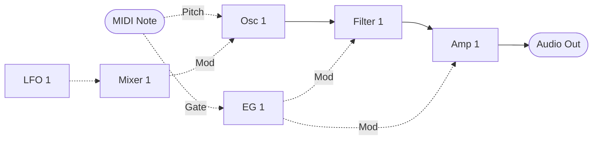
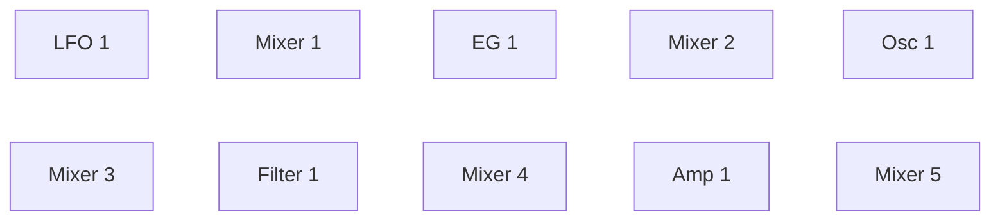

MIDI Synthesizer SPMS-1 (type-1) v0.0.3
=======================================

- Monophonic semi-modular MIDI Synthesizer for M5Stack AtomS3 Lite and Raspberry Pi Pico 2, made with Spinel (Ruby AOT Compiler)
- Controlled by MIDI as a sound module
- 48 kHz/24 bit audio output
- Filter: ZDF/TPT State Variable Filter (with delayed soft clipping)
- Developed by ISGK Instruments (Ryo Ishigaki)
- <https://github.com/risgk/midi_synthesizer_spms1>
- [日本語版 README](./README.ja.md)


Required Hardware
-----------------

- M5Stack AtomS3 Lite (ESP32-S3), recommended
    - M5Stack [AtomS3 Lite](https://shop.m5stack.com/products/atoms3-lite-esp32s3-dev-kit) (SKU: C124)
    - M5Stack [Atomic Audio-3.5 Base](https://shop.m5stack.com/products/atomic-audio-3-5-base) (SKU: A166)
- Raspberry Pi Pico 2 (RP2350)
    - [Raspberry Pi Pico 2](https://www.raspberrypi.com/products/raspberry-pi-pico-2/)
    - Pimoroni [Pico Audio Pack](https://shop.pimoroni.com/products/pico-audio-pack) (PIM544)
        - The following I2S DAC hardware (48 kHz/24 bit) can also be used:
            - [Adafruit PCM5102 I2S DAC](https://www.adafruit.com/product/6250) (Product ID: 6250)
            - GY-PCM5102 (PCM5102A I2S DAC Module)


Required Software for Modification
----------------------------------

- [Arduino IDE](https://www.arduino.cc/en/software)
- For M5Stack AtomS3 Lite: Arduino core for the ESP32 (by Espressif Systems)
    - This sketch is tested with version 3.3.11: <https://github.com/espressif/arduino-esp32/releases/tag/3.3.11>
    - Info: <https://github.com/espressif/arduino-esp32>
    - Board: "M5AtomS3", with USB Mode: "USB-OTG (TinyUSB)" in the "Tools" menu. USB MIDI, I2S
      and I2C all come from the core, so no library beyond the Arduino MIDI Library is needed
- For Raspberry Pi Pico 2: Arduino-Pico = Raspberry Pi Pico/RP2040/RP2350 (by Earle F. Philhower, III) core
    - Additional Board Manager URL: <https://github.com/earlephilhower/arduino-pico/releases/download/global/package_rp2040_index.json>
    - This sketch is tested with version 6.1.1: <https://github.com/earlephilhower/arduino-pico/releases/tag/6.1.1>
    - Info: <https://github.com/earlephilhower/arduino-pico>
    - Board: "Raspberry Pi Pico 2", with USB Stack: "Adafruit TinyUSB" in the "Tools" menu
- Arduino MIDI Library (by Francois Best, lathoub)
    - This sketch is tested with version 5.0.2: <https://github.com/FortySevenEffects/arduino_midi_library/releases/tag/5.0.2>
    - Info: <https://github.com/FortySevenEffects/arduino_midi_library>
- Spinel
    - Commit: <https://github.com/matz/spinel/tree/5af61ae7d53e36ca59a8de5870f532360d88fd7c>
    - The Spinel output file "spms1_main.c" needs no editing. "sp_runtime.h" in this sketch
      carries `#define main IRAM_ATTR __attribute__((flatten)) Spms1_main` for the ESP32-S3 and
      `#define main __attribute__((section(".time_critical"), flatten)) Spms1_main` for the
      RP2350, which renames it and puts the synth core in RAM (IRAM on the ESP32-S3) at the same
      time. Renaming it by hand instead leaves the macro with nothing to match, and the core runs
      from flash


Usage
-----

### Prebuilt Binary

- "spms1_type1.ino.merged.bin" (in the "bin" folder) is for M5Stack AtomS3 Lite and Atomic Audio-3.5 Base
    - Hold the AtomS3 Lite's reset button for about 2 seconds, until the green LED inside lights,
      to put it into download mode. Then write the file at address 0x0, with esptool (it ships
      with the Arduino core for the ESP32), for example:

        ```
        esptool --chip esp32s3 --port COM7 write-flash 0x0 spms1_type1.ino.merged.bin
        ```

    - Or, with nothing to install, open [esptool-js](https://espressif.github.io/esptool-js/) in
      Chrome or Edge, "Connect" to the AtomS3 Lite, and "Program" the file at Flash Address 0x0
    - Then unplug and replug the USB cable to start it; the reset at the end of writing leaves it
      in download mode


### Web Editor

- Cross-platform web-based parameter controller via Web MIDI API: "spms1_editor.html"
- Built-in software keyboard for note input and testing
- Graphical patch editor (experimental) on its Patch tab
    - Wires module outputs to inputs and parameters, and sets the run order and CC assignments
    - Saves and loads patches as JSON
    - Copies the patch as MIDI bytes or as an NRPN list, or sends it through Web MIDI


### MIDI Settings

- MIDI Channel: Channel 1
- USB MIDI Input
    - Manufacturer Descriptor: "ISGK Instruments" (Raspberry Pi Pico 2 only; the AtomS3 Lite
      keeps the core's own, because USB CDC On Boot starts USB before the sketch can set it)
    - Device Name: "SPMS-1 (type-1)"
    - On Windows, the AtomS3 Lite's MIDI interface can come up bound to the "USB JTAG debug unit"
      driver (WinUSB), which some ESP32 tools install for the same VID/PID in the Hardware CDC
      mode. It then does not show up as a MIDI device. Change its driver in the Device Manager
      to "USB Audio Device"
- UART MIDI Input
    - Speed: 31250 bps
    - M5Stack AtomS3 Lite: G2 and G1 pins (Grove port) are used by UART2 TX and UART2 RX
        - M5Stack [Unit MIDI](https://shop.m5stack.com/products/midi-unit-with-din-connector-sam2695)
          (SKU: U187) plugs straight into the Grove port as the DIN MIDI interface, in Separate mode
        - To use the AtomS3 Lite itself as a Grove unit, driven over the Grove port by another
          M5Stack controller, swap the two pins:

            ```cpp
            #define SPMS1_UART_MIDI_TX_PIN              (1)     // Grove
            #define SPMS1_UART_MIDI_RX_PIN              (2)     // Grove
            ```

    - Raspberry Pi Pico 2: GP4 and GP5 pins are used by UART1 TX and UART1 RX
    - On the Raspberry Pi Pico 2, you can also use `SoftwareSerial` by making the following changes:

        ```cpp
        #include <SoftwareSerial.h>
        #define SPMS1_UART_MIDI_TX_PIN              (4)
        #define SPMS1_UART_MIDI_RX_PIN              (5)
        SoftwareSerial mySerial(SPMS1_UART_MIDI_RX_PIN, SPMS1_UART_MIDI_TX_PIN);
        #define SPMS1_UART_MIDI_SERIAL              mySerial
        ```

        ```cpp
        //  SPMS1_UART_MIDI_SERIAL.setTX(SPMS1_UART_MIDI_TX_PIN);
        //  SPMS1_UART_MIDI_SERIAL.setRX(SPMS1_UART_MIDI_RX_PIN);
        ```

    - DIN/TRS MIDI is available by using (and modifying) Adafruit MIDI FeatherWing Kit, for example
        - Adafruit [MIDI FeatherWing Kit](https://www.adafruit.com/product/4740) (Product ID: 4740)
        - M5Stack [Midi Unit with DIN Connector (SAM2695)](https://shop.m5stack.com/products/midi-unit-with-din-connector-sam2695) (SKU: U187) in Separate mode
        - Kinoshita Laboratory [MIDI-UART interface-san Kit](https://www.tindie.com/products/kinoshitalab/midi-uart-interface-san-kit/)
        - 木下研究所 [MIDI-UARTインターフェースさん キット](https://www.switch-science.com/products/8117) (Shipping to Japan only)
        - necobit電子 [MIDI Unit for GROVE](https://necobit.com/denshi/grove-midi-unit/) (Shipping to Japan only)
        - necobit電子 [MIDI Unit Mini for GROVE](https://necobit.com/denshi/midi-unit-mini-for-grove/) (Shipping to Japan only)


### Latency

About 4 ms from a MIDI message to the sound that answers it:

- Two output buffers of 64 samples each: 2.7 ms
- MIDI is read once per buffer, so a message waits up to one more: 1.3 ms

That is the synth's own; what the MIDI link and the DAC add sits on top of it.


### [MIDI Implementation Chart](./spms1_midi_chart.md)


### Block Diagram

The default patch. Solid arrows carry audio, dashed arrows carry control.



Each module is processed once per sample, in the run order below. Their parameters -- waveform,
cutoff, gain and the rest -- arrive from CC and are left out of the diagram.

Mixer 1 is in the vibrato path to scale the LFO down to 0.2, both of its levels reading the
constant 0.2. Osc 1 Mod Amt spans the whole pitch range, as every modulation depth here does, so
bringing a source down to a musical depth is left to a mixer rather than built into the
oscillator.

None of this is fixed. NRPN rewrites the run order, every arrow above, and which CC feeds each
parameter.

#### The run order

Every module is in it, one of each kind that makes a sound and a mixer behind each of them:



Mixers 2 to 5 have nothing routed to them, so they cost their slot every sample and change
nothing until a patch gives them something. Where each one sits is what it buys: a module sees
the current sample's value only from something ahead of it in this line, and last sample's from
anything behind. Mixer 1 can reach the LFO, Mixer 3 can reach the oscillator, and so on.

A mixer is what lets two of anything meet, and what makes a signal that runs one way, such as the
envelope, swing both ways. See the examples below.

### Patch Editing (NRPN)

The patch is data, and NRPN rewrites it while the synth is running: which modules run and in what
order, what feeds each module input, where each parameter takes its value from, and which CC fills
each control slot. Every module reads from a numbered signal slot and writes to one, so rewiring is
a matter of changing slot numbers.

#### Sending

- CC 99 selects the category, CC 98 the entry within it, in either order
- CC 6 (Data Entry MSB) commits the value, and takes effect on the next audio buffer
- CC 38 (Data Entry LSB) is ignored: every value here is 7-bit
- CC 101 and CC 100 (RPN select) suspend data entry, so an RPN is never taken as a patch edit.
  Send CC 99 or CC 98 again to resume
- Edits are not saved. The default patch is restored at power-on

#### Categories (CC 99)

| CC 99 | CC 98 | Sets | CC 6 value |
| ----- | ----- | ---- | ---------- |
| 0 | 0-31 | Run order, slot by slot | Module ID |
| 1 | 0-17 | What feeds a module input | Signal ID |
| 2 | 0-32 | Where a parameter takes its value | Signal ID |
| 3 | 0-40 | Which CC fills a control slot | CC number, or 0 for none |

The run order is read from slot 0 upwards and stops at the first Module ID 0, so a patch shorter
than 32 modules ends itself. It is separate from the module numbering: a module only sees the
current sample's value from something listed before it, and last sample's from something after.

In category 3, CC number 0 means the parameter has no CC. Its control slot then keeps whatever it
already holds, so the parameter can be driven by routing alone.

There is one of every module that makes a sound and there are five mixers, and **all ten are in
the default run order**, so a patch only ever has to route, never to switch something on first.
A mixer is the only kind with no CC on any of its parameters: their control slots are seeded
instead, at full level and no inversion, so a mixer with one input routed passes it through
rather than muting it. Mixer 1's two levels read the constant 0.2 instead, because the default
patch runs the LFO through it.

#### Entries (CC 98), category 1

| CC 98 | Module input | | CC 98 | Module input |
| ----- | ------ | - | ----- | ------ |
| 0 | EG 1 Gate | | 9 | Mixer 2 In 1 |
| 1 | Osc 1 Pitch | | 10 | Mixer 2 In 2 |
| 2 | Osc 1 Mod In | | 11 | Mixer 3 In 1 |
| 3 | Filter 1 Audio In | | 12 | Mixer 3 In 2 |
| 4 | Filter 1 Mod In | | 13 | Mixer 4 In 1 |
| 5 | Amp 1 Audio In | | 14 | Mixer 4 In 2 |
| 6 | Amp 1 Mod In | | 15 | Mixer 5 In 1 |
| 7 | Mixer 1 In 1 | | 16 | Mixer 5 In 2 |
| 8 | Mixer 1 In 2 | | 17 | Final Output |

Most of these take what their name suggests, but three do not say it on their face. A Gate is a
threshold rather than a level: an envelope triggers as the signal crosses 0.5 and releases as it
falls back. A Pitch is -0.5 to +0.5 across MIDI notes 0 to 120, so 0.0 is note 60 and a tenth of
a unit is an octave. And a Mod In is taken as it arrives: nothing is held to a range on the way
in, and what gets clamped is the value the module ends up with -- cutoff to the ends of its dial,
pitch to -0.5 and +0.5. A mixer adds without a ceiling, so a loud modulation pins its
destination at one end rather than being trimmed on the way in. The amp is the exception, and
holds its modulation input to -1.0 and +1.0: it is an attenuator, so a modulation may scale its
gain down but never up.

#### Entries (CC 98), categories 2 and 3

| CC 98 | Parameter | | CC 98 | Parameter | | CC 98 | Parameter |
| ----- | ------ | - | ----- | ------ | - | ----- | ------ |
| 0 | LFO 1 Rate | | 11 | Filter 1 Mod Amt | | 22 | Mixer 3 Invert 1 |
| 1 | EG 1 Attack | | 12 | Amp 1 Gain | | 23 | Mixer 3 Level 2 |
| 2 | EG 1 Decay | | 13 | Mixer 1 Level 1 | | 24 | Mixer 3 Invert 2 |
| 3 | EG 1 Sustain | | 14 | Mixer 1 Invert 1 | | 25 | Mixer 4 Level 1 |
| 4 | Osc 1 Wave | | 15 | Mixer 1 Level 2 | | 26 | Mixer 4 Invert 1 |
| 5 | Osc 1 Coarse Tune | | 16 | Mixer 1 Invert 2 | | 27 | Mixer 4 Level 2 |
| 6 | Osc 1 Fine Tune | | 17 | Mixer 2 Level 1 | | 28 | Mixer 4 Invert 2 |
| 7 | Osc 1 Mod Amt | | 18 | Mixer 2 Invert 1 | | 29 | Mixer 5 Level 1 |
| 8 | Filter 1 Cutoff | | 19 | Mixer 2 Level 2 | | 30 | Mixer 5 Invert 1 |
| 9 | Filter 1 Resonance | | 20 | Mixer 2 Invert 2 | | 31 | Mixer 5 Level 2 |
| 10 | Filter 1 Gain | | 21 | Mixer 3 Level 1 | | 32 | Mixer 5 Invert 2 |

#### Entries (CC 98), category 3 only

These slots belong to no parameter, so category 2 has no entry for them. See the General slots
below.

| CC 98 | Control slot | | CC 98 | Control slot |
| ----- | ------ | - | ----- | ------ |
| 33 | General Unipolar 1 | | 37 | General Bipolar 1 |
| 34 | General Unipolar 2 | | 38 | General Bipolar 2 |
| 35 | General Unipolar 3 | | 39 | General Bipolar 3 |
| 36 | General Unipolar 4 | | 40 | General Bipolar 4 |

#### Module IDs

| ID | Module |
| ----- | ------ |
| 0 | None (ends the run order) |
| 1 | LFO 1 |
| 2 | EG 1 |
| 3 | Osc 1 |
| 4 | Filter 1 |
| 5 | Amp 1 |
| 6 | Mixer 1 |
| 7 | Mixer 2 |
| 8 | Mixer 3 |
| 9 | Mixer 4 |
| 10 | Mixer 5 |

#### Signal IDs

| ID | Signal | | ID | Signal | | ID | Signal |
| ----- | ------ | - | ----- | ------ | - | ----- | ------ |
| 0 | None (constant 0.0) | | 21 | Osc 1 Wave | | 42 | Mixer 4 Level 1 |
| 1 | Constant 1.0 | | 22 | Osc 1 Coarse Tune ± | | 43 | Mixer 4 Invert 1 |
| 2 | Constant 0.5 | | 23 | Osc 1 Fine Tune ± | | 44 | Mixer 4 Level 2 |
| 3 | Constant 0.2 | | 24 | Osc 1 Mod Amt | | 45 | Mixer 4 Invert 2 |
| 4 | Constant -0.2 | | 25 | Filter 1 Cutoff | | 46 | Mixer 5 Level 1 |
| 5 | Constant -0.5 | | 26 | Filter 1 Resonance | | 47 | Mixer 5 Invert 1 |
| 6 | Constant -1.0 | | 27 | Filter 1 Gain | | 48 | Mixer 5 Level 2 |
| 7 | LFO 1 Output ± | | 28 | Filter 1 Mod Amt | | 49 | Mixer 5 Invert 2 |
| 8 | EG 1 Output | | 29 | Amp 1 Gain | | 50 | Note Pitch ± |
| 9 | Osc 1 Output ± | | 30 | Mixer 1 Level 1 | | 51 | Note Gate |
| 10 | Filter 1 Output ± | | 31 | Mixer 1 Invert 1 | | 52 | Pitch Bend ± |
| 11 | Amp 1 Output ± | | 32 | Mixer 1 Level 2 | | 53 | General Unipolar 1 |
| 12 | Mixer 1 Output ± | | 33 | Mixer 1 Invert 2 | | 54 | General Unipolar 2 |
| 13 | Mixer 2 Output ± | | 34 | Mixer 2 Level 1 | | 55 | General Unipolar 3 |
| 14 | Mixer 3 Output ± | | 35 | Mixer 2 Invert 1 | | 56 | General Unipolar 4 |
| 15 | Mixer 4 Output ± | | 36 | Mixer 2 Level 2 | | 57 | General Bipolar 1 ± |
| 16 | Mixer 5 Output ± | | 37 | Mixer 2 Invert 2 | | 58 | General Bipolar 2 ± |
| 17 | LFO 1 Rate | | 38 | Mixer 3 Level 1 | | 59 | General Bipolar 3 ± |
| 18 | EG 1 Attack | | 39 | Mixer 3 Invert 1 | | 60 | General Bipolar 4 ± |
| 19 | EG 1 Decay | | 40 | Mixer 3 Level 2 | |  |  |
| 20 | EG 1 Sustain | | 41 | Mixer 3 Invert 2 | |  |  |

A **±** marks a signal that swings both ways: a module output reaches -0.5 and +0.5 at full
scale, a bipolar control slot runs -0.5 to +0.5, and a mixer sums two of them and stops at one.
Everything unmarked runs 0.0 to 1.0 -- an envelope's output, Note Gate and every unipolar
control slot. The bus carries both kinds under one numbering, so the range belongs to the slot
rather than to the sort of thing that wrote it.

Slots 17-49 hold the values arriving from CC, so a parameter reads its own CC by default. Each
parameter is unipolar or bipolar, and its slot takes the same range. A unipolar one runs 0.0 to
1.0 from CC 4 to CC 124, the span of an envelope, so an envelope pointed at one sweeps the whole
of its dial. A bipolar one runs -0.5 to +0.5 with CC 64 at 0.0, the span of an LFO, so a bipolar
source pointed at one swings it about the middle. Only the two tune controls are bipolar, since
their middle is no change at all. Pointing a parameter at another slot is what makes a
modulation. Anything with no CC sits at what it was seeded with until one is assigned.

Slots 53-60, the General slots, are control slots that no parameter owns: a CC put on the bus for
any module input or parameter to read. General Unipolar 1-4 run 0.0 to 1.0 and General Bipolar
1-4 run -0.5 to +0.5. Both sets read CC 16-19 by default, so each of those CCs arrives both ways
at once, and both power up at CC 64: the unipolar slots at 0.5, the bipolar ones at 0.0.

Note Pitch, Note Gate and Pitch Bend are what the keyboard puts on the bus. Note Pitch carries
MIDI notes 0 to 120 as -0.5 to +0.5, the same span the oscillator reads as its whole pitch
range, and Pitch Bend is bipolar too, one unit across the whole wheel: exactly -0.5 and +0.5 at
the ends of its travel and exactly zero at the centre detent, so it can feed a module input
without a mixer to shift it. Note Gate is 0.0 or 1.0, and an envelope triggers at 0.5. Nothing
is routed to Pitch Bend by default.

Slots 0-6 are constants that nothing writes, for inputs that want a fixed value rather than a
source. Signal 0 is also what an entry nobody has set reads as, so an unrouted input is silent
rather than wired to whatever sits in the first slot. Signal 1 is the value an unmodulated input
wants: routing an amp's modulation input to it leaves the amp at full level. Signals 0 and 1 are
the two ends of a unipolar parameter's range and Signals 5 and 2 of a bipolar one, for pinning
one there; Signal 2 is also the middle of a unipolar dial. Signal 3 is the level the default
patch gives Mixer 1, a fifth of full scale, and Signal 4 its negative. A constant on a mixer's
second input shifts a signal between the two kinds: -0.5 turns one that runs one way into one
that swings both, and +0.5 the other way round.

Slot 127 is where a parameter with no CC sends its unused value. Nothing should read it.

The ID numbers are not stable across firmware versions. A patch is never saved, so a new module
type, another instance of one, or another signal may renumber everything after it. Read these
tables again after an update.

#### Ranges worth knowing

Both tune controls are centred on CC 64 and move one whole unit per CC step: Coarse Tune a
semitone, reaching 5 octaves either way, and Fine Tune a cent, reaching 60 either way. They are
summed, so any pitch is reachable.

Osc 1 Mod Amt is a depth, not an offset, and it reaches the whole pitch range: at its top a bipolar
source swings the pitch five octaves up and five down. That is a coarse dial for vibrato, half a
semitone per CC step, which is why the default patch runs the LFO through Mixer 1 at 0.2 first. On
that path a semitone of vibrato sits at CC 14 and an octave at the top of the dial.

Filter 1 Gain sets how hard the audio input drives the filter, which is also what decides how far
the filter runs into its own saturation. Its default of CC 64 is the level the oscillator used to
be scaled to on its own; above that the filter starts to compress the loud part of a note.

A mixer takes each input at its own level and its own polarity, then adds them. Level runs from
silent at 0.0 (CC 4) to full at 1.0 (CC 124), and Invert from unchanged at 0.0, through silence
at 0.5, to negated at 1.0. Levels default to full and inverts to unchanged, so a mixer
with one input routed is a buffer; inverting that one input makes it an inverter; and inverting
only the second makes the mixer a subtractor. Mixer 1 is the exception: the default patch points
both of its levels at the constant 0.2, for the vibrato path it is wired into.

The sum is held to -1.0 and +1.0. Two full-scale signals reach exactly that, so nothing ordinary
is cut; what it stops is a mixer wired back to its own input, which would otherwise double every
sample until the number stopped being a number and took the oscillator or the filter with it.
The filter is held to the same one unit, by a curve rather than a corner: its output passes
untouched up to half a unit, which is more than the default patch ever reaches, and above that
bends smoothly onto the limit. Its resonant peak can climb past one unit on a sweep, and rounding
that off makes far weaker high harmonics than a hard edge would fold back down into the note.

#### Examples

- Vibrato is wired by default -- the LFO reaches the oscillator's modulation input through
  Mixer 1 -- so CC 13 sets the depth and CC 3 the rate
- Filter cutoff follows note pitch (keyboard tracking): CC 99 = 1, CC 98 = 4, CC 6 = 50 puts
  Note Pitch on the filter's modulation input in the envelope's place. With the cutoff at CC 64
  and Mod Amt at CC 124, note 60 leaves the cutoff at the middle of its dial and each note moves
  it a semitone
- Filter cutoff swept by the LFO about the middle of its dial: CC 99 = 1, CC 98 = 4, CC 6 = 7.
  A module input is read every sample, so the LFO can run at any rate
- Filter cutoff driven by the envelope instead of its CC: CC 99 = 2, CC 98 = 8, CC 6 = 8. The
  envelope and the cutoff are both unipolar, so it opens the cutoff from the bottom of its dial
  to the top
- Amp gain and filter cutoff share one CC: CC 99 = 3, CC 98 = 12, CC 6 = 74
- Amp at full level with no envelope: CC 99 = 1, CC 98 = 6, CC 6 = 1
- Disconnect the filter's modulation input: CC 99 = 1, CC 98 = 4, CC 6 = 0
- A pitch envelope 60 cents deep: CC 99 = 2, CC 98 = 6, CC 6 = 8 points Osc 1 Fine Tune at the
  envelope, which then sweeps the tuning from in tune up to 60 cents sharp, reached at half the
  envelope's peak
- The envelope drives the filter harder as a note starts: CC 99 = 2, CC 98 = 10, CC 6 = 8 takes
  the filter's input level from silence up to the top of its dial and back
- Pitch swept by the envelope instead of the LFO: CC 99 = 1, CC 98 = 7, CC 6 = 8 puts the
  envelope on Mixer 1's first input in the LFO's place, then set the depth on CC 13 -- a semitone
  at 14, an octave at 124
- Pitch bend, which nothing is routed to by default. CC 99 = 1 with CC 98 = 9 and 10, CC 6 = 50
  and 52 puts Note Pitch and Pitch Bend on Mixer 2's two inputs, and CC 99 = 1, CC 98 = 1,
  CC 6 = 13 makes that sum the oscillator's pitch. Mixer 2 runs ahead of the oscillator, so the
  wheel moves the note in the same sample. Both levels are full, so the wheel reaches five
  octaves either way; CC 99 = 2, CC 98 = 19, CC 6 = 53 takes Mixer 2's second level from General
  Unipolar 1, so CC 16 trims that down to a bend range worth playing
- A CC that bends pitch both ways through the modulation input. Mixer 1 already feeds the
  oscillator's modulation input, so it only has to be given something else to mix: CC 99 = 1,
  CC 98 = 7, CC 6 = 25 puts the filter cutoff's control slot on its first input in the LFO's
  place, and CC 98 = 8, CC 6 = 5 puts the constant -0.5 on its second. The slot is unipolar, so
  that constant is what centres it on CC 64 as the LFO is on zero, and both inputs are at 0.2, so
  CC 74 now bends the pitch down and up around the note at vibrato depth
- A CC that works backwards, which needs a mixer to invert it. Mixer 2 is already running, so it
  only needs wiring: CC 99 = 1, CC 98 = 9, CC 6 = 25 puts the cutoff's control slot on its first
  input and CC 98 = 10, CC 6 = 1 the constant 1.0 on its second, and CC 99 = 2, CC 98 = 18,
  CC 6 = 1 pins the first input's invert to 1.0, the negating end of its dial, so the mixer
  outputs 1.0 less the CC: the CC mirrored about CC 64. Point the cutoff's own source at the
  mixer with CC 99 = 2, CC 98 = 8, CC 6 = 13 and CC 74 now closes the filter as it rises
- Take the filter out of the chain: CC 99 = 1, CC 98 = 5, CC 6 = 9 points the amp's audio input
  at the oscillator. The filter keeps running and keeps its slot; nothing reads it

#### Notes

- Module inputs (category 1) are read every sample and are not smoothed; parameters (category 2)
  are read once per buffer and are smoothed by their destination. Route a fast source through a
  module input, a stepped one through a parameter
- A parameter source may point at any of the 128 slots. Slots above 60 read 0 until something
  writes them, which leaves a parameter pointed at one at the bottom of a unipolar dial or the
  middle of a bipolar one
- A parameter clamps its value to its own range, 0.0 to 1.0 or -0.5 to +0.5, and its control slot
  carries that same range onto the bus. A unipolar slot routed to a module input runs one way,
  as an envelope does; it takes a mixer and the constant -0.5 to swing both ways about CC 64
- The NRPN CCs are stored as ordinary controls too, so a parameter may be mapped to CC 6 -- which
  then moves it every time a patch edit is sent
- A feedback loop through the bus -- a mixer wired back to its own input at a level below full,
  directly or through other modules -- decays toward zero and can settle on a denormal, which
  x86 computes slowly, so the PC simulator there may slow down. Nothing in the loop flushes it

### Debug UART

- M5Stack AtomS3 Lite: USB CDC (the serial port next to USB MIDI on the same cable)
- Raspberry Pi Pico 2
    - Speed: 115200 bps
    - GP0 and GP1 pins are used by UART0 TX and UART0 RX


### PC Simulators

- Spinel output (experimental): "sim_spinel" -- builds "spms1_main.c" and the runtime in this folder, unmodified,
  for Windows or macOS and runs it in real time, with audio out through PortAudio and MIDI in
  through WinMM or CoreMIDI. Build with `sh sim_spinel/build.sh` (MinGW gcc in Git Bash on
  Windows, clang on macOS), then run `build/sim_spinel/spms1_sim --midi-in NAME`; `--list` shows
  the MIDI inputs
    - The build first regenerates "spms1_main.c" with Spinel, found on the PATH or, on Windows,
      inside WSL. `--no-spinel`, or no Spinel to be found, builds the one already here
    - PortAudio is loaded at run time. The PortAudio project releases source only; on Windows,
      install it into RubyInstaller's MSYS2 with
      `ridk exec pacman -S mingw-w64-ucrt-x86_64-portaudio` (the simulators look there), and on
      macOS with `brew install portaudio`. `SPMS1_PORTAUDIO_DLL` gives a path of your own
    - Not tested on macOS
- CRuby (experimental): "sim_cruby" -- runs "spms1_main.rb" itself on CRuby, with PortAudio
  through the ffi gem, installed as above, and MIDI in through WinMM on Windows and the unimidi
  gem on macOS: `ruby sim_cruby/spms1_sim.rb --midi-in NAME`. The interpreter does not keep up
  with the default patch in real time
    - Not tested on macOS
- Offline WAV output: "sim_offline/spms1_output_wav.rb" -- renders the default patch offline, the
  same modules in the same order with the CC values the synth powers up with, save for two: Decay
  is at the top of its dial so the note carries as far into the render as it can, and Cutoff a
  quarter of the way up so the envelope opening it is what you hear. It does not reproduce the
  signals bus or the run order, so it catches a change in a module, not in a routing


### Checking the Generated Code

What the compiler makes of a change to the per-sample path is worth looking at before flashing it,
and "branchless in Ruby" does not mean branchless in the binary -- the decision is GCC's, and it
depends on the whole function. The steps below are for the Raspberry Pi Pico 2 build. Compile the
Spinel output on its own, from the sketch folder:

```
arm-none-eabi-gcc -c -g -mcpu=cortex-m33 -mthumb -march=armv8-m.main+fp+dsp -mfloat-abi=softfp -mcmse -std=gnu23 -Os -I. -o out.o spms1_main.c
```

The compiler ships with the Arduino-Pico core, under `packages/rp2040/tools/pqt-gcc`. It takes
about a minute. Then `arm-none-eabi-objdump -d out.o` and count the conditional branches inside
`Spms1_main`, and `arm-none-eabi-objdump --dwarf=decodedline out.o` to map an address back to the
line of Ruby it came from -- the generated C carries `#line` directives that point at the `.rb`
files, so the mapping survives all the way down.

Four things to know before reading the output:

- The `-Os` above is not what the synth is built with. "sp_runtime.h" carries
  `#pragma GCC optimize ("O3")`, which overrides whatever is on the command line for that
  translation unit. Passing `-O3` instead changes nothing, and neither does passing `-Os`
- The synth core is not in `.text`. The `#define main` in "sp_runtime.h" puts it in
  `.time_critical`. To prove two builds are the same code,
  `arm-none-eabi-objcopy -O binary --only-section=.time_critical` on each and compare the bytes.
  A comment-only edit moves every `#line` in "spms1_main.c" and nothing else, and this is how to
  confirm it
- A standalone compile runs about 2000 instructions lighter than the linked firmware, because
  `flatten` pulls the sketch's own functions into `Spms1_main` when it is built for real.
  Differences between two standalone builds are reliable; absolute totals are not. Take those
  from the `.elf` the Arduino build leaves in its sketch cache
- A shape that compiles well in a test function may not survive inlining into `Spms1_main`, which
  is about 30000 instructions. Measure the change in the real file, not in a small one


SPMS-1 (type-1) Licence
-----------------------

```
MIDI Synthesizer SPMS-1 (type-1) by ISGK Instruments (Ryo Ishigaki) is marked with CC0 1.0.
To view a copy of this license, visit https://creativecommons.org/publicdomain/zero/1.0/
```

- Target files: `spms1_*.*`


Spinel Licence
--------------

```
Copyright (c) 2024- Yukihiro Matsumoto (matz@ruby.or.jp)

Permission is hereby granted, free of charge, to any person obtaining a
copy of this software and associated documentation files (the "Software"),
to deal in the Software without restriction, including without limitation
the rights to use, copy, modify, merge, publish, distribute, sublicense,
and/or sell copies of the Software, and to permit persons to whom the
Software is furnished to do so, subject to the following conditions:

The above copyright notice and this permission notice shall be included in
all copies or substantial portions of the Software.

THE SOFTWARE IS PROVIDED "AS IS", WITHOUT WARRANTY OF ANY KIND, EXPRESS OR
IMPLIED, INCLUDING BUT NOT LIMITED TO THE WARRANTIES OF MERCHANTABILITY,
FITNESS FOR A PARTICULAR PURPOSE AND NONINFRINGEMENT. IN NO EVENT SHALL THE
AUTHORS OR COPYRIGHT HOLDERS BE LIABLE FOR ANY CLAIM, DAMAGES OR OTHER
LIABILITY, WHETHER IN AN ACTION OF CONTRACT, TORT OR OTHERWISE, ARISING
FROM, OUT OF OR IN CONNECTION WITH THE SOFTWARE OR THE USE OR OTHER
DEALINGS IN THE SOFTWARE.
```

- Base Commit: <https://github.com/matz/spinel/tree/5af61ae7d53e36ca59a8de5870f532360d88fd7c>
- Target files: `sp_*.*`, `re_*.*`
    - Note: Some files for runtime are modified for MCU by ISGK Instruments (Ryo Ishigaki)
